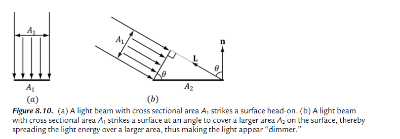
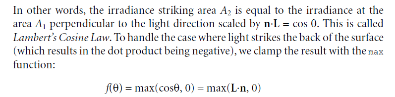
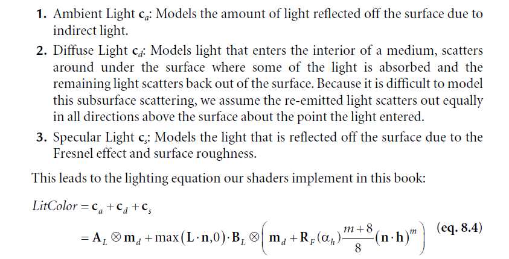

## Lighting

### Diffuse Lighting

**Lambert's Cosine Law**:

Let BL represent the quantity of incoming light, md be the diffuse albedo color, L be
the light vector, and n be the surface normal. Then the amount of diffuse light
refl ected off a point is given by:

**cd = max(L·n, 0)·BL * md**

### Ambient Lighting
The color AL specifies the total amount of indirect (ambient) light a surface
receives, which may be different than the light emitted from the source due to the
absorption that occurred when the light bounced off other surfaces. The diffuse
albedo md specifies the amount of incoming light that the surface reflects due to
diffuse reflectance.

**ca = AL * md**

### Specular Lighting

**Fresnel Effest**: the amount of reflected light depends
on the material (RF(0)) and the angle between the normal and light vector.

**Roughness**

### Parallel Light

### Point Light
I(d) = I0 / d^2

att(d) = saturate((falloffEnd - d) / (fallofEnd - fallofStart))

saturate(x) = (x < 0) ? 0 : ( x > 1 ? 1 : x ) 

### Spot Light

k()
