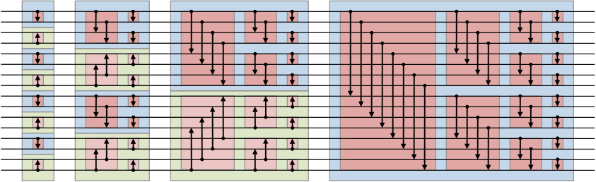

## Bitonic Sort

Bitonic Sort双调排序是data-independent的排序，即比较顺序与数据无关的排序方法，适合并行计算。

1. Bitonic Sequence(双调序列)

双调序列是一个先单调递增后单调递减（或者先单调递减后单调递增）的序列。

2. Batcher定理

将任意一个长为2n的双调序列A分为等长的两半X和Y，将X中的元素与Y中的元素一一按原序比较，即a[i]与a[i+n] (i < n)比较，将较大者放入MAX序列，较小者放入MIN序列。则得到的MAX和MIN序列仍然是双调序列，并且MAX序列中的任意一个元素不小于MIN序列中的任意一个元素。

3. Bitonic Merge(双调合并)

把一个序列(1…n)对半分，假设n=2^k，然后1和n/2+1比较，小的放上，接下来2和n/2+2比较，小的放上，以此类推；然后看成两个(n/2)长度的序列，因为他们都是双调序列，所以可以重复上面的过程；总共重复k轮，即最后一轮已经是长度是2的序列比较了，就可得到最终的排序结果。


4. Bitonic Sort(双调排序)

将两个相邻的、单调性相反的单调序列看作一个双调序列，进行双调合并。

Worst-case performance      $ O(\log ^{2}(n)) $ parallel time

Best-case performance       $ O(\log ^{2}(n)) $ parallel time

Average performance         $ O(\log ^{2}(n)) $ parallel time

Worst-case space complexity $ O(n\log ^{2}(n)) $ parallel time




5. n!=2^k

这样的双调排序算法只能应付长度为2的幂的数组。那如何转化为能针对任意长度的数组呢？一个直观的方法就是使用padding。即使用一个定义的最大或者最小者来填充数组，让数组的大小填充到2的幂长度，再进行排序。最后过滤掉那些最大（最小）值即可。这种方式会使用到额外的空间，而且有时候padding的空间比较大（如数组长度为1025个元素，则需要填充到2048个，浪费了大量空间）。但是这种方法比较容易转化为针对GPU的并行算法。所以一般来说，并行计算中常使用双调排序来对一些较小的数组进行排序。如果要考虑不用padding，也有更复杂的处理方法。

6. Example Code
```
// The following is a recursion-free implementation of the bitonic mergesort when the array length is a power of two
// given an array arr of length n, this code sorts it in place
// all indices run from 0 to n-1
for (k = 2; k <= n; k *= 2) // k is doubled every iteration
    for (j = k/2; j > 0; j /= 2) // j is halved at every iteration, with truncation of fractional parts
        for (i = 0; i < n; i++)
            l = bitwiseXOR (i, j); // in C-like languages this is "i ^ j"
            if (l > i)
                if (  (bitwiseAND (i, k) == 0) AND (arr[i] > arr[l])
                    OR (bitwiseAND (i, k) != 0) AND (arr[i] < arr[l]) )
                        swap the elements arr[i] and arr[l]
```
