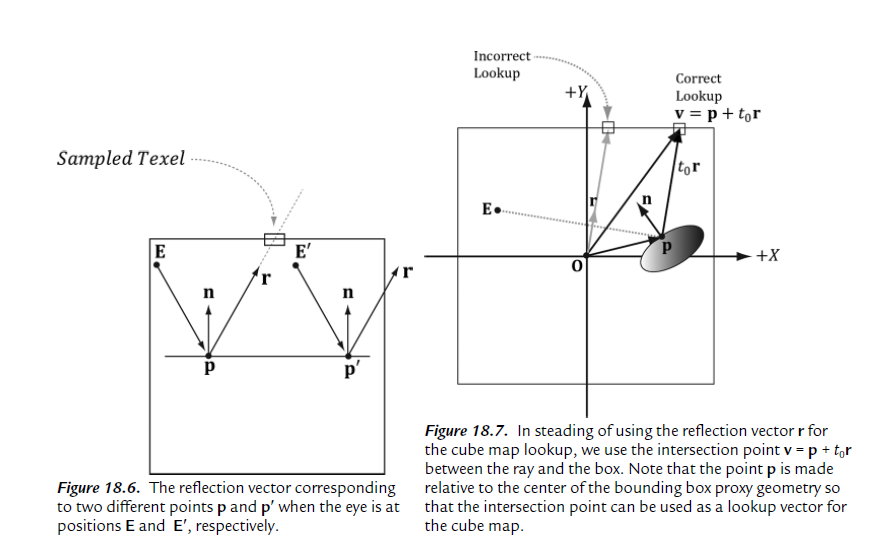

## Cube Mapping

The idea of cube mapping is to store six textures and to visualize them as the faces
of a cube—hence the name cube map—centered and axis aligned about some
coordinate system. Since the cube texture is axis aligned, each face corresponds
with a direction along the three major axes; therefore, it is natural to a reference
a particular face on a cube map based on the axis direction (±X, ±Y, ±Z) that
intersects the face.

To identify a texel in a cube map, we use 3D texture coordinates,
which define a 3D lookup vector v originating at the origin. The texel of the
cube map that v intersects (see Figure 18.1) is the texel corresponding to the 3D
coordinates of v. The magnitude of the lookup vector is unimportant, only the direction matters. Two vectors with the same direction but different magnitudes will sample the
same point in the cube map.

In the HLSL, a cube texture is represented by the TextureCube type.
``` hlsl
TextureCube gCubeMap;
```

### Environment Maps

The primary application of cube maps is environment mapping.
The idea is to position a camera at the center of some object O in the scene with a 90 field of
view angle (both vertically and horizontally). Then have the camera look down
the positive x-axis, negative x-axis, positive y-axis, negative y-axis, positive z-axis,
and negative z-axis, and to take a picture of the scene (excluding the object O)
from each of these six viewpoints. Because the field of view angle is 90, these six
images will have captured the entire surrounding environment from the perspective of the object O. We then store these six images of the
surrounding environment in a cube map, which leads to the name environment
map.

The above description suggests that we need to create an environment map
for each object that is to use environment mapping. While this would be more
accurate, it also requires more texture memory. A compromise would be to use a
few environment maps that capture the environment at key points in the scene.
Then objects will sample the environment map closest to them. This simplifi cation usually works well in practice because with curved objects inaccurate refl ections
are hard to notice. Another simplifi cation often taken with environment mapping
is to omit certain objects from the scene.

Because cube maps just store texture data, their contents can be pre-generated
by an artist (just like the 2D textures we’ve been using). Consequently, we do not
need to use real-time rendering to compute the images of a cube map. That is,
we can create a scene in a 3D world editor, and then pre-render the six cube map
face images in the editor.

### Texturing A Sky

We can use an environment map to texture a sky. We create a large sphere that
surrounds the entire scene. We assume that the sky sphere is infi nitely far away (i.e., it is centered about the world space but has infi nite radius), and so no matter how the camera moves in the world, we never appear to get closer or farther from the surface of the sky sphere. To implement this infi nitely faraway sky, we simply center the sky sphere
about the camera in world space so that it is always centered about the camera.
Consequently, as the camera moves, we are getting no closer to the surface of the
sphere.

In addition, rendering the sky requires some different render states. In particular,
because the camera lies inside the sphere, we need to disable back face culling (or
making counterclockwise triangles front facing would also work), and we need to
change the depth comparison function to LESS_EQUAL so that the sky will pass the
depth test. Otherwise, the normalized depth values at z = 1 (NDC) will
fail the depth test if the depth buffer was cleared to 1.

### Modeling Relections

In this section, we show how to use
environment maps to model specular reflections coming from the surrounding
environment.

An advanced topic we
do not discuss uses cube maps to compute diffuse lighting from the surrounding
environment as well.

When we render a scene about a point O to build an environment map, we
are recording light values coming in from all directions about the point O. In
other words, the environment map stores the light values coming in from every
direction about the point O, and we can think of every texel on the environment
map as a source of light. We use this data to approximate specular refl ections of light coming from the surrounding environment.

Because we are talking about reflections, we need to apply the Fresnel effect,
which determines how much light is reflected from the environment into the
eye based on the material properties of the surface and the angle between the
light vector (reflection vector) and normal. In addition, we scale the amount of
reflection based on the shininess of the material—a rough material should have a
low amount of reflection, but still some reflection.

Reflections via environment mapping do not work well for flat surfaces.
This is because the reflection vector does not tell the whole story, as it does
not incorporate position; we really need a refl ection ray and to intersect the ray
with the environment map. A ray has position and direction, whereas a vector
just has direction. For flat objects this defect of environment mapping is very noticeable. For curvy surfaces, this
shortcoming of environment mapping goes largely unnoticed, since the curvature
of the surface causes the refl ection vector to vary.



One solution is to associate some proxy geometry with the environment map.
For example, suppose we have an environment map for a square room. We can
associate an axis-aligned bounding box with the environment map that has
approximately the same dimensions as the room. Figure 18.7 then shows how we
can do a ray intersection with the box to compute the vector v which gives a better
lookup vector than the refl ection vector r. If the bounding box associated with
the cube map is input into the shader (e.g., via a constant buffer), then the ray/
box intersection test can be done in the pixel shader, and we can compute the
improved lookup vector in the pixel shader to sample the cube map.

The following function shows how the cube map look up vector can be
computed.

``` hlsl
float3 BoxCubeMapLookup(float3 rayOrigin, float3 unitRayDir, float3 boxCenter, float3 boxExtents)
{
    // Based on slab method as described in Real-Time Rendering
    // 16.7.1 (3rd edition).
   
    // Make relative to the box center.
    float3 p = rayOrigin - boxCenter;
    
    // The ith slab ray/plane intersection formulas for AABB are:
    //
    // t1 = (-dot(n_i, p) + h_i)/dot(n_i, d) = (-p_i + h_i)/d_i
    // t2 = (-dot(n_i, p) - h_i)/dot(n_i, d) = (-p_i - h_i)/d_i
    
    // Vectorize and do ray/plane formulas for every slab together.
    float3 t1 = (-p+boxExtents)/unitRayDir;
    float3 t2 = (-p-boxExtents)/unitRayDir;
    
    // Find max for each coordinate. Because we assume the ray is inside
    // the box, we only want the max intersection parameter.
    float3 tmax = max(t1, t2);
    
    // Take minimum of all the tmax components:
    float t = min(min(tmax.x, tmax.y), tmax.z);
    
    // This is relative to the box center so it can be used as a
    // cube map lookup vector.
    return p + t*unitRayDir;
}
```

### Dynamic Cube Maps

every frame you position the camera in the scene that is to be the origin of the cube map, and then render the scene six times into each cube map face along each coordinate axis direction. Since the cube map is rebuilt every frame, it will capture animated objects in the environment, and the reflection will be animated as well.

### Dynamic Cube Maps With The Geometry Shader

In the previous section, we redrew the scene six times to generate the cube map—
once for each cube map face. Draw calls are not free, and we should work to
minimize them.
There is a Direct3D 10 sample called “CubeMapGS,” which uses
the geometry shader to render a cube map by drawing the scene only once.

We bound a view to an array of render targets and a view to an array
of depth stencil buffers to the OM stage, and we are going to render to each array
slice simultaneously.

Now, the scene is rendered once and an array of six view matrices (one to
look in the corresponding direction of each cube map face) is available in the
constant buffers. The geometry shader replicates the input triangle six times,
and assigns the triangle to one of the six render target array slices. Assigning
a triangle to a render target array slice is done by setting the system value SV_
RenderTargetArrayIndex. This system value is an integer index value that can only
be set as an output from the geometry shader to specify the index of the render
target array slice the primitive should be rendered onto. This system value can
only be used if the render target view is actually a view to an array resource.

``` hlsl
struct PS_CUBEMAP_IN
{
    float4 Pos : SV_POSITION; // Projection coord
    float2 Tex : TEXCOORD0; // Texture coord
    uint RTIndex : SV_RenderTargetArrayIndex;
};
[maxvertexcount(18)]
void GS_CubeMap( triangle GS_CUBEMAP_IN input[3], inout TriangleStream<PS_CUBEMAP_IN> CubeMapStream )
{
    // For each triangle
    for( int f = 0; f < 6; ++f )
    {
        // Compute screen coordinates
        PS_CUBEMAP_IN output;

        // Assign the ith triangle to the ith render target.
        output.RTIndex = f;
        
        // For each vertex in the triangle
        for( int v = 0; v < 3; v++ )
        {
            // Transform to the view space of the ith cube face.
            output.Pos = mul( input[v].Pos, g_mViewCM[f] );
            
            // Transform to homogeneous clip space.
            output.Pos = mul( output.Pos, mProj );
            
            output.Tex = input[v].Tex;
            CubeMapStream.Append( output );
        }
        CubeMapStream.RestartStrip();
    }
}
```

There are two issues that make this method unattractive:

1. It uses the geometry shader to output a large set of data. Recall that we mentioned the geometry shader acts inefficiently when outputting a large set of data. Therefore, using a geometry shader for this purpose could hurt performance.

2. In a typical scene, a triangle will not overlap more than one cube map face. Therefore, the act of replicating a triangle and rendering
it onto each cube face when it will be clipped by five out of six of the faces
is wasteful. Admittedly, our demo for this chapter also renders the entire
scene to each cube map face for simplicity. However, in real applications
(non-demo), we would use frustum culling (Chapter 16), and only render
the objects visible to a particular cube map face. Frustum culling at the object
level cannot be done by a geometry shader implementation.

On the other hand, a situation where this strategy does work well would be
rendering a mesh that surrounds the scene. For example, suppose that you had
a dynamic sky system where the clouds moved and the sky color changed based
on the time of day. Because the sky is changing, we cannot use a prebaked cube
map texture to reflect the sky, so we have to use a dynamic cube map. Since the sky
mesh surrounds the entire scene, it is visible by all six cube map faces. Therefore,
the second bullet point above does not apply, and the geometry shader method
could be a win by reducing draw calls from six to one, assuming usage of the
geometry shader does not hurt performance too much.

Recent optimizations available in NVIDIA’s Maxwell architecture enables
geometry to be replicated to multiple render targets with without the penalties
of using a geometry shader (see [Viewport Multicast](https://docs.nvidia.com/gameworks/content/gameworkslibrary/graphicssamples/opengl_samples/cascadedshadowmapping.htm#:~:text=With%20the%20new%20Viewport%20Multicast,gives%20a%20noticeable%20performance%20increase.)).
