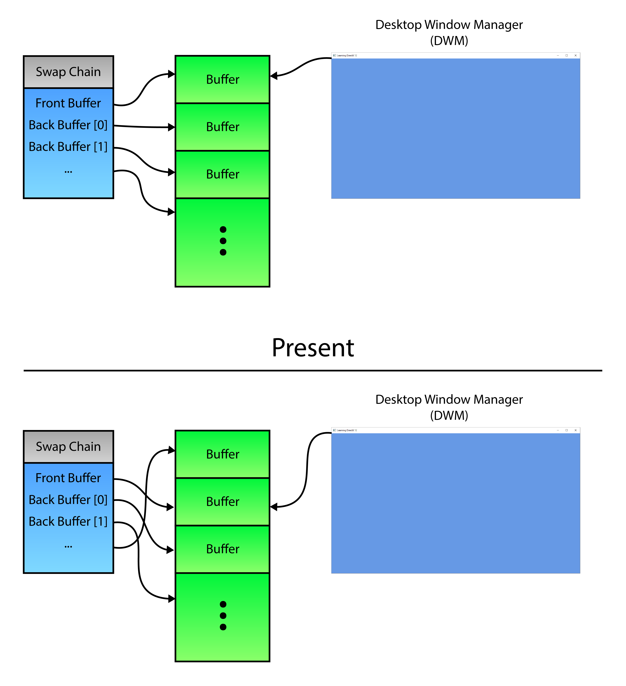
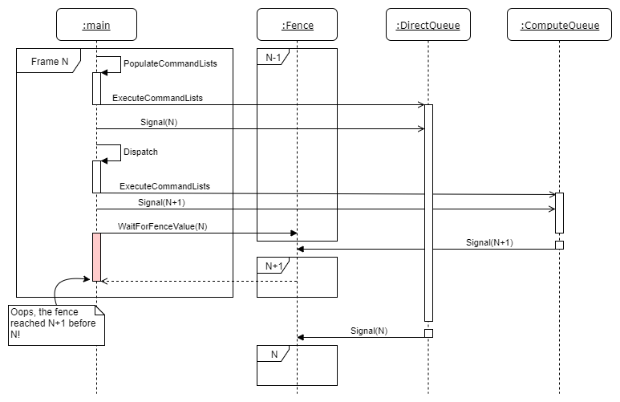
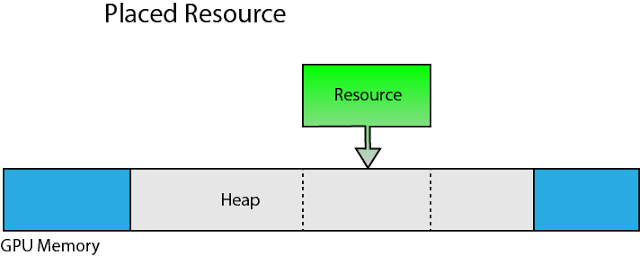
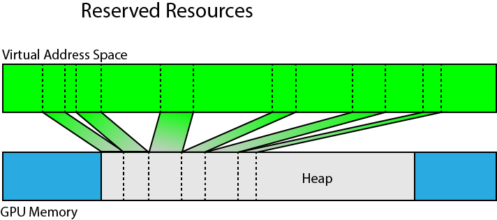
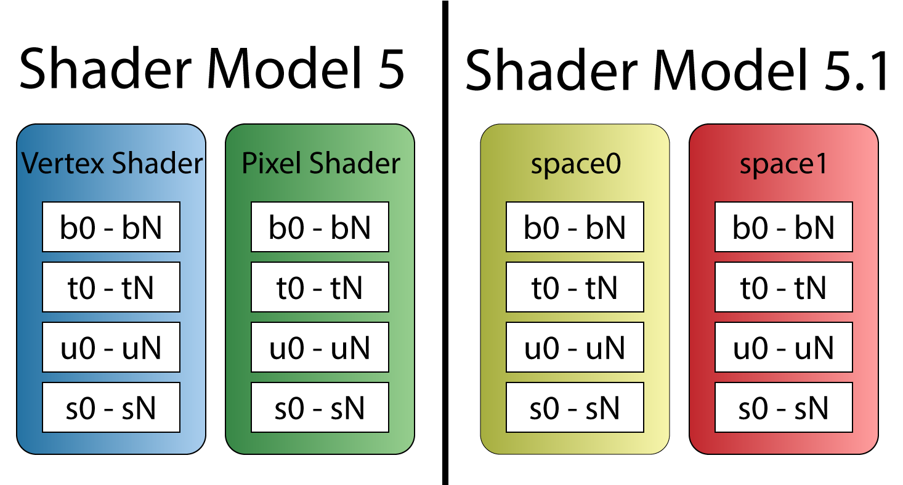
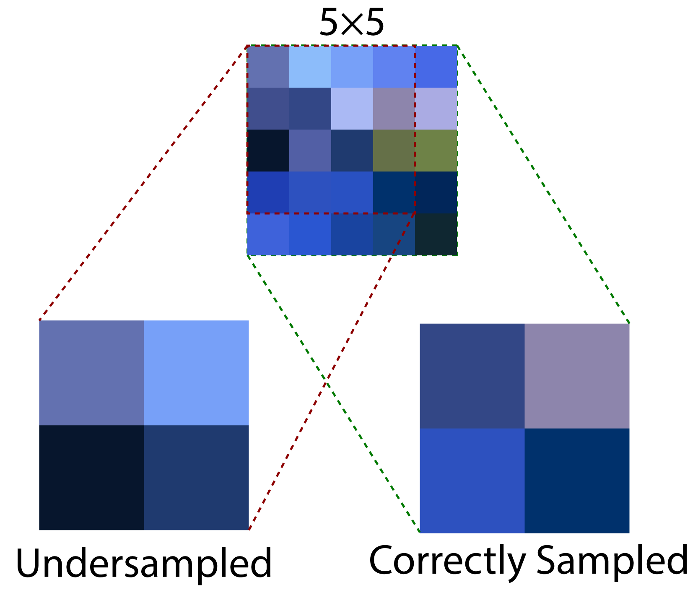
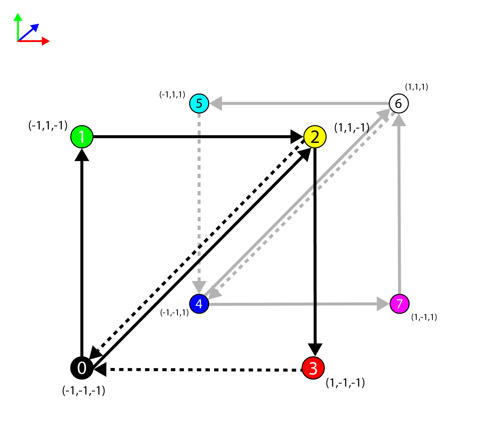

## Initialize DirectX 12

1. Enable the Debug Layer
2. Create a Window
3. Query the GPU adapters
4. Create a DirectX 12 Device
5. Create Command Queues
6. Check for Tearing Support
7. Create a Swap Chain
8.  Create Descriptor Heaps
9.  Create Render Target Views
10. Create Command Allocators
11. Create Command Lists
12. Create Fences
13. Handle GPU synchronization
14. Update & Render

### Enable the Direct3D 12 Debug Layer

See [D3D12GetDebugInterface](https://learn.microsoft.com/en-us/windows/win32/api/d3d12/nf-d3d12-d3d12getdebuginterface) and [ID3D12Debug::EnableDebugLayer](https://learn.microsoft.com/en-us/windows/win32/api/d3d12sdklayers/nf-d3d12sdklayers-id3d12debug-enabledebuglayer)

### Create a Window

See [RegisterClassExW](https://learn.microsoft.com/en-us/windows/win32/api/winuser/nf-winuser-registerclassexw) and [CreateWindow](https://learn.microsoft.com/en-us/windows/win32/api/winuser/nf-winuser-createwindowexw)

### Query the GPU adapters

See [IDXGIFactory1::EnumAdapters1](https://learn.microsoft.com/en-us/windows/win32/api/dxgi/nf-dxgi-idxgifactory1-enumadapters1) and [IDXGIFactory4::EnumWarpAdapter](https://learn.microsoft.com/en-us/windows/win32/api/dxgi1_4/nf-dxgi1_4-idxgifactory4-enumwarpadapter)

### DirectX 12 Device

See [D3D12CreateDevice](https://learn.microsoft.com/en-us/windows/win32/api/d3d12/nf-d3d12-d3d12createdevice)

### Command Queue

See [ID3D12Device::CreateCommandQueue](https://learn.microsoft.com/en-us/windows/win32/api/d3d12/nf-d3d12-id3d12device-createcommandqueue)

The Command Queue in DirectX 12 has a very simple interface. For most common cases only the `ID3D12CommandQueue::ExecuteCommandLists` method and the `ID3D12CommandQueue::Signal` method are used.

The `ID3D12CommandQueue::Signal` method will append a fence value to the end of the command queue. The fence object that is used to signal the command queue will have it’s completed value set to the value of the signal when processing has reached that point in the command queue.

It is important to understand that each command queue must track it’s own fence and fence value. DirectX 12 defines three different command queue types:
* **Copy**: Can be used to issue commands to copy resource data (CPU -> GPU, GPU -> GPU, GPU -> CPU).
* **Compute**: Can do everything a Copy queue can do and issue compute (dispatch) commands.
* **Direct**: Can do everything a Copy and a Compute queue can do and issue draw commands.

### Tearing Support

To create an application that supports variable refresh rate displays, the `DXGI_FEATURE_PRESENT_ALLOW_TEARING` feature must be supported and the `DXGI_SWAP_CHAIN_FLAG_ALLOW_TEARING` must be specified when creating the swap chain. Additionally, the `DXGI_PRESENT_ALLOW_TEARING` flag must be used when presenting the swap chain with a sync-interval of 0.

See [IDXGIFactory5::CheckFeatureSupport](https://learn.microsoft.com/en-us/windows/win32/api/dxgi1_5/nf-dxgi1_5-idxgifactory5-checkfeaturesupport)

### Swap Chain

See [IDXGIFactory2::CreateSwapChainForHwnd](https://learn.microsoft.com/en-us/windows/win32/api/dxgi1_2/nf-dxgi1_2-idxgifactory2-createswapchainforhwnd)

The primary purpose of the swap chain is to present the rendered image to the screen. The swap chain stores no less than two buffers that are used to render the scene. The buffer that is currently being rendered to is called the back buffer and the buffer that is currently being presented is called the front buffer. The back buffer is swapped with the front buffer using the `IDXGISwapChain::Present` method.



### Descriptor Heap

See [ID3D12Device::CreateDescriptorHeap](https://learn.microsoft.com/en-us/windows/win32/api/d3d12/nf-d3d12-id3d12device-createdescriptorheap)

A descriptor heap can be visualized as an array of descriptors (views). A view simply describes a resource that resides in GPU memory. As of DirectX 12, before resource views can be created (such as Render Target Views (RTV), Shader Resource Views (SRV), Unordered Access Views (UAV), or Constant Buffer Views (CBV)), a descriptor heap needs to be created.

**RTV**

A render target view (RTV) describes a resource that can be attached to a bind slot of the output merger stage. The render target view describes the resource that receives the final color computed by the pixel shader stage.

### Command Allocator

See [ID3D12Device::CreateCommandAllocator](https://learn.microsoft.com/en-us/windows/win32/api/d3d12/nf-d3d12-id3d12device-createcommandallocator)

A command allocator must not be reset until we are sure the GPU has finished executing all the commands in the allocator.

A command allocator is the backing memory used by a command list. A command allocator is created using the `ID3D12Device::CreateCommandAllocator` method and must specify the type of command list the allocator will be used with. The command allocator does not provide any functionality and can only be accessed indirectly through a command list. A command allocator can only be used by a single command list at a time but can be reused after the commands that were recorded into the command list have finished executing on the GPU.


### Command List

See [ID3D12Device::CreateCommandList](https://learn.microsoft.com/en-us/windows/win32/api/d3d12/nf-d3d12-id3d12device-createcommandlist)

A Command List is used to issue copy, compute (dispatch), or draw commands. In DirectX 12 commands issued to the command list are not executed immediately like they are with the DirectX 11 immediate context. All command lists in DirectX 12 are deferred; that is, the commands in a command list are only run on the GPU after they have been executed on a command queue.

Unlike the command allocator, the command list can be reused immediately after it has been executed on the command queue. The only restriction is that the command list must be reset first before recording any new commands.

### Fence

See [ID3D12Device::CreateFence](https://learn.microsoft.com/en-us/windows/win32/api/d3d12/nf-d3d12-id3d12device-createfence)

The Fence object is used to synchronize commands issued to the Command Queue. The fence stores a single value that indicates the last value that was used to signal the fence. Although it is possible to use the same fence object with multiple command queues, it is not reliable to ensure the proper synchronization of commands across command queues. Therefore, it is advised to create at least one fence object for each command queue. Multiple command queues can wait on a fence to reach a specific value, but the fence should only be allowed to be signaled from a single command queue. In addition to the fence object, the application must also track a fence value that is used to signal the fence. An example of performing CPU-GPU synchronization using fences will be shown in the following sections.

### GPU-Synchronization


This example demonstrates a typical double-buffered scenario. You might think that using triple-buffering for rendering will reduce the amount of time the CPU has to wait for the GPU to finish its work. Whenever the CPU is faster at issuing commands than the command queue is at processing those commands, the CPU will have to stall at some point in order to allow the command queue to catch-up to the CPU.

It gets more complicated if you add an additional queue. In this case, you must be careful not to signal the second queue with a fence value that is larger than, but could be completed before, a fence value that was used on another queue using the same fence object. Doing so could result in the fence reaching the fence value from the other queue before the main queue has reached the earlier fence value.



Every command queue should track its own fence object and fence value and only signal its own fence object. To be safe, the fence value for a queue should never be allowed to decrease.


## Resource Barrier

In DirectX 12, it is the responsibility of the graphics programmer to ensure that resources are in the correct state before using them. Resources must be transitioned from one state to another using a resource barrier and inserting that resource barrier into the command list. 

There are several types of resource barriers:

* Transition: Transitions a (sub)resource to a particular state before using it. For example, before a texture can be used in a pixel shader, it must be transitioned to the PIXEL_SHADER_RESOURCE state.
* Aliasing: Specifies that a resource is used in a placed or reserved heap when that resource is aliased with another resource in the same heap.
* UAV: Indicates that all UAV accesses to a particular resource have completed before any future UAV access can begin. This is necessary when the UAV is transitioned for:
    * Read > Write: Guarantees that all previous read operations on the UAV have completed before being written to in another shader.
    * Write > Read: Guarantees that all previous write operations on the UAV have completed before being read from in another shader.
    * Write > Write: Avoids race conditions that could be caused by different shaders in a different draw or dispatch trying to write to the same resource (does not avoid race conditions that could be caused in the same draw or dispatch call).
    * A UAV barrier is not needed if the resource is being used as a read-only (Read > Read) resource between draw or dispatches.


### Heap and Resources

In DirectX 12 the only interface used to describe a resource is the [ID3D12Resource](https://msdn.microsoft.com/en-us/library/windows/desktop/dn788709(v=vs.85).aspx) interface.

DirectX 12 also provides more control over the way the resource is stored in GPU memory. The [ID3D12Heap](https://msdn.microsoft.com/en-us/library/windows/desktop/dn788687(v=vs.85).aspx) interface allows for various memory mapping techniques to be implemented which may be used to optimize GPU memory utilization.

A swap chain contains one or more texture resources that are used to present the final rendered image to the screen. The creation of the texture resource for the swap chain is hidden in the [IDXGIFactory2::CreateSwapChainForHwnd](https://msdn.microsoft.com/en-us/library/hh404557(v=vs.85).aspx) method. In this case, the graphics programmer has no control over how and where the resource is created. In this section, several buffer resources are required to render the scene. For these resources, the graphics programmer must decide how those buffer resources are created. There are several different ways that GPU resources are allocated within a memory heap ([ID3D12Heap](https://msdn.microsoft.com/en-us/library/dn788687(v=vs.85).aspx)):

* **Committed Resources**

A committed resource is created using the [ID3D12Device::CreateCommittedResource](https://msdn.microsoft.com/en-us/library/dn899178(v=vs.85).aspx) method. This method creates both the resource and an implicit heap that is large enough to hold the resource. The resource is also mapped to the heap. Committed resources are easy to manage because the graphics programmer doesn’t need to be concerned with placing the resource within the heap.


Committed resources are ideal for allocating large resources like textures or statically sized resources (the size of the resource does not change). Committed resource are also commonly used to create large resource in an upload heap that can be used for uploading dynamic vertex or index buffers (useful for UI rendering or uploading constant buffer data that is changing for each draw call).

* **Placed Resources**

A placed resource is explicitly placed in a heap at a specific offset within the heap. Before a placed resource can be created, first a heap is created using the [ID3D12Device::CreateHeap](https://msdn.microsoft.com/en-us/library/dn788664(v=vs.85).aspx) method. The placed resource is then created inside the heap using the [ID3D12Device::CreatePlacedResource](https://msdn.microsoft.com/en-us/library/dn899180(v=vs.85).aspx) method.



The size of the heap that will be used for placed resources must be known in advance. Creating larger than necessary heaps is not a good idea because the only way to reclaim the GPU memory used by the heap is to either evict the heap or completely destroy it. Since you can only evict an entire heap from GPU memory, any resources that are currently placed in the heap must not be referenced in a command list that is being executed on the GPU.

Multiple placed resources can be aliased in a heap as long as they don’t access the same aliased heap space at the same time.


Aliasing can help to reduce oversubscribing GPU memory usage since the size of the heap can be limited to the size of the largest resource that will be placed in the heap at any moment in time. Aliasing can be used as long as the same space in the heap is not used by multiple aliasing resources at the same time. Aliased resources can be swapped using a [D3D12_RESOURCE_ALIASING_BARRIER](https://msdn.microsoft.com/en-us/library/dn986739(v=vs.85).aspx).

* **Reserved Resources**

Reserved resources are created without specifying a heap to place the resource in. Reserved resources are created using the [ID3D12Device::CreateReservedResource](https://msdn.microsoft.com/en-us/library/dn899181(v=vs.85).aspx) method. Before a reserved resource can be used, it must be mapped to a heap using the [ID3D12CommandQueue::UpdateTileMappings](https://msdn.microsoft.com/en-us/library/dn788641(v=vs.85).aspx) method.



Reserved resources can be created that are larger than can fit in a single heap. Portions of the reserved resource can be mapped (and unmapped) using one or more heaps residing in physical GPU memory.

Using reserved resources, a large volume texture can be created using virtual memory but only the resident spaces of the volume texture needs to be mapped to physical memory. This resource type provides options for implementing rendering techniques that use **sparse voxel octrees** without exceeding GPU memory budgets.

### Pipeline State Object

In order to provide better state management in DirectX 12, the pipeline state object (PSO) is used to describe the various stages of the rendering (and compute) pipeline. The PSO combines parts of the input assembly (IA), vertex shader (VS), hull shader (HS), domain shader (DS), geometry shader (GS), stream output (SO), rasterizer stage (RS), pixel shader (PS), and output merger (OM) stages of the rendering pipeline. A few properties of the rendering pipeline (such as viewport and scissor rectangle) require additional API calls but most of the configuration of the rendering pipeline is controlled by the PSO.

The Pipeline State Object (PSO) contains most of the state that is required to configure the rendering (or compute) pipeline. The graphics pipeline state object includes the following information:

* Shader bytecode (vertex, pixel, domain, hull, and geometry shaders)
* Vertex format input layout
* Primitive topology type (point, line, triangle, or patch)
* Blend state
* Rasterizer state
* Depth-stencil state
* Number of render targets and render target formats
* Depth-stencil format
* Multisample description
* Stream output buffer description
* Root signature

The pipeline state object structure contains a lot of information and if any of the state needs to change between draw calls (for example, a different pixel shader or blend state is needed) then a new pipeline state object needs to be created.

Although the pipeline state object contains a lot of information, there are a few additional parameters that must be set outside of the pipeline state object.

* Vertex and Index buffers
* Stream output buffer
* Render targets
* Descriptor heaps
* Shader parameters (constant buffers, read-write buffers, and read-write textures)
* Viewports
* Scissor rectangles
* Constant blend factor
* Stencil reference value
* Primitive topology and adjacency information

The pipeline state object can optionally be specified for a graphics command list when the command list is reset using the [ID3D12GraphicsCommandList::Reset](https://msdn.microsoft.com/en-us/library/dn903895(v=vs.85).aspx) method but it can also be changed for the command list at any time using the [ID3D12GraphicsCommandList::SetPipelineState](https://msdn.microsoft.com/en-us/library/dn903918(v=vs.85).aspx) method.

### Root Signatures

Another new concept in DirectX 12 is the root signature. A root signature describes the parameters that are passed to the various programmable shader stages of the rendering pipeline. Examples of parameters that are passed to the programmable shader stages are constant buffers, (read-write) textures, and (read-write) buffers. Texture samplers (an object that determines how the texels in a texture are sampled and filtered) are also defined in the root signature.

A root signature is similar to a C++ function signature, that is, it defines the parameters that are passed to the shader pipeline. The values that are bound to the pipeline are called the root arguments. The arguments that are passed to the shader can change without changing the root signature parameters.

The root parameters in the root signature not only define the type of the parameters that are expected in the shader, they also define the shader registers and register spaces to bind the arguments to in the shader.

### Shader Register & Register Spaces

Shader parameters must be bound to a register. For example, constant buffers are bound to b registers (b0 – bN), shader resource views (textures and non-constant buffer types) are bound to t registers (t0 – tN), unordered access views (writeable textures and buffer types) are bound to u registers (u0 – uN), and texture samplers are bound to s registers (s0 – sN) where N is the maximum number of shader registers.

In previous versions of DirectX, different resources could be bound to the same register slot if they were used in different shader stages of the rendering pipeline. For example, a constant buffer could be bound to register b0 in the vertex shader and a different constant buffer could be bound to register b0 in the pixel shader without causing overlap.

DirectX 12 root signatures require that all shader parameters be defined for all stages of the rendering pipeline and registers used across different shader stages may not overlap. In order to provide a work-around for legacy shaders that may violate this rule, Shader Model 5.1 introduces register spaces. Resources can overlap register slots as long as they don’t also overlap register spaces.



### Root Signature Parameters

A root signature can contain any number of parameters. Each parameter can be one of the following types:

[D3D12_ROOT_PARAMETER_TYPE](https://docs.microsoft.com/en-us/windows/desktop/api/d3d12/ne-d3d12-d3d12_root_parameter_type)

* D3D12_ROOT_PARAMETER_TYPE_32BIT_CONSTANTS    :    32-bit Root Constants
* D3D12_ROOT_PARAMETER_TYPE_CBV                :    Inline CBV Descriptor
* D3D12_ROOT_PARAMETER_TYPE_SRV                :    Inline SRV Descriptor
* D3D12_ROOT_PARAMETER_TYPE_UAV                :    Inline UAV Descriptor
* D3D12_ROOT_PARAMETER_TYPE_DESCRIPTOR_TABLE   :    Descriptor Table

**32-BIT CONSTANTS**

Constant buffer data can be passed to the shader without the need to create a constant buffer resource by using the 32-bit constants. Dynamic indexing into the constant buffer data is not supported for constant data that is stored in the root signature space. For example, the following constant buffer definition can be mapped to 32-bit constants stored in the root signature:
``` hlsl
cbuffer TransformsCB : register(b0, space0)
{
    matrix Model;
    matrix View;
    matrix Projection;
}
```
But, due to the array, the following constant buffer definition cannot be mapped to 32-bit constants in the root signature and instead requires either an inline descriptor or a descriptor heap to map the resource:
``` hlsl
cbuffer TransformsCB : register(b0, space0)
{
    matrix MVPMatrices[3];
}
```
Each root constant in the root signature costs 1 DWORD (32-bits)

**INLINE DESCRIPTORS**

Descriptors can be placed directly in the root signature without requiring a descriptor heap. Only constant buffers (CBV), and buffer resources (SRV, UAV) resources containing 32-bit (FLOAT, UINT, or SINT) components can be accessed using inline descriptors in the root signature. Inline UAV descriptors for buffer resources cannot contain counters. Texture resources cannot be referenced using inline descriptors in the root signature and must be placed in a descriptor heap and referenced through a descriptor table.

Unlike root constants, constant buffers containing arrays may be accessed using inline descriptors in the root signature. For example, the following constant buffer can be referenced using inline descriptors:
``` hlsl
cbuffer SceneData : register(b0, space0)
{
   uint foo;
   float bar[2];
   int moo;
};
```
Each inline descriptor in the root signature costs 2 DWORDs (64-bits)

**DESCRIPTOR TABLES**

A descriptor table defines several descriptor ranges that are placed consecutively in a GPU visible descriptor heap.


The above image illustrates a root signature with a single descriptor table parameter (A). The descriptor table contains three descriptor ranges (B): 3 Constant Buffer Views (CBV), 4 Shader Resource Views (SRV), and 2 Unordered Access Views (UAV). CBV’s, SRV’s and UAV’s can be referenced in the same descriptor table since all three types of descriptors can be stored in the same descriptor heap. The GPU visible descriptors (C) must appear consecutively in a GPU visible descriptor heap but the resources that they refer to (D) may appear anywhere in GPU memory, even in different resource heaps.

Each descriptor table in the root signature costs 1 DWORD (32-bits)

### Static Samplers

A texture sampler describes how a texture should be sampled. It describes the filtering, addressing, and Level of Detail (LOD) to use while sampling from a texture. Texture samplers can be defined directly in the root signature without the need of a descriptor heap. The [D3D12_STATIC_SAMPLER_DESC](https://msdn.microsoft.com/en-us/library/dn986748(v=vs.85).aspx) structure is used to define a texture sampler directly in the root signature.

Static samplers do not use any space in the root signature and do not count against the size limit of the root signature.

### Root Signature Constraints

Root signatures are limited to 64 DWORDs (2048-bits) [5]. Each root parameter has a cost that counts towards the root signature limit:

* 32-bit constants each costs 1 DWORD
* Inline descriptors each costs 2 DWORDs
* Descriptor tables each costs 1 DWORD

Static samplers defined in the root signature do not count towards the size of the root signature.

The cost of accessing a root argument in a root signature in terms of levels of indirection is zero for 32-bit constants, 1 for inline descriptors, and 2 for descriptor tables

The graphics programmer should strive to achieve a root signature that is as small as possible but balance the flexibility of using a larger root signature. Parameters in the root signature should be ordered based on the likelihood that the arguments will change. If the root arguments are changing often then they should appear first in the root signature. If the root arguments are not changing often, then they should be the last parameters that appear in the root signature. Since 32-bit constants and inline descriptors have better performance in terms of level of indirection, they should be favored over using descriptor tables as long as the size of the root signature does not become to large.


### Group Shared Memory

Group shared memory is memory that is shared among all threads in a thread group. According to Microsoft’s documentation, group shared memory is limited to 16KB for D3D10 level hardware and 32KB for D3D11 level hardware. There is no specification for the amount of shared memory that is available for D3D12. The amount of shared memory actually available to the thread group is dependent on the GPU architecture.

In order to maintain maximum thread occupancy, a compute shader should not declare more than 16KB of group shared memory. In order to mitigate latency incurred by fetches to global memory, a streaming multiprocessor will queue multiple thread groups. If a thread group declares more than the maximum amount of shared memory that can be satisfied by all of the queued thread groups, the thread scheduler will reduce the number of thread groups until the utilized shared memory can be satisfied.

Group shared memory is split into (16 or 32 depending on GPU architecture) equally sized memory banks whose addresses are 32-bit interleaved. The interleaved addresses allow each thread in a wave to access a different memory banks without causing bank conflicts. Bank conflicts occur when different threads in wave access the same memory bank but not the same address. Bank conflicts can occur more frequently when the access stride between threads in a wave are not increments of 32-bits. When a bank conflict does occur, the memory controller is required to perform multiple reads from shared memory to satisfy all read requests. When no bank conflict occurs, then the memory controller can satisfy all reads from group shared memory in the same amount of time as a single read (reading data from shared memory can be coalesced).

It is recommended to ensure that threads in a wave access shared memory addresses that are at 32-bit offsets relative to the index of the thread within the thread group (SV_GroupIndex). It is also recommended to split memory declared in group shared memory by 32-bit values. For example, it is more efficient to declare four arrays of floats than a single array of 4-component floats.

### Generate Mipmaps Compute Shader

Generating mipmaps is the process of computing an image that is half the size of the original image. The process is repeated until a 1×1 image is generated. For the remainder of the discussion, the term source mip is used to refer to the mip level that is used as the source of the next mip in the chain and the term destination mip is used to refer to the mip that is being generated.

Undersampling occurs when texels from the source mip are not used during downsampling. In order to avoid undersampling from textures with an odd dimension, multiple samples need to be read from the source mip.

Since sRGB textures are not supported for UAV writes, a UAV compatible copy of the original texture is used to perform the mipmapping. Gamma correction must be applied when the original texture has an sRGB format.

### Non Power of Two

For example, a 5×5 texture reduces to a size of 2.5×2.5. Of course, it is not possible to have a fraction of a pixel in a texture so the 0.5 must be truncated from the texture’s dimension. If only a single sample is taken from the source mip to generate the destination mip, then the resulting mip will be undersampled resulting in a slightly incorrect color in the final mip. If several mip levels are undersampled, noticeable artifacts can appear in the rendered image. In order to avoid undersampling the texture, several samples are taken from the source mip and blended together to produce the destination mip color.



### sRGB

sRGB (standard red, green, and blue) is an RGB color space developed by HP and Microsoft in 1996 for use on monitors, printers, and the internet[6]. sRGB colors are encoded using a transfer function (gamma curve) that was typical of the gamma response of CRT monitors at the time. The sRGB transfer function is still used in current (low dynamic range) LCD screens which is why image compression formats (such as JPEG, and PNG) will typically still encode images in an sRGB format.

Since sRGB image formats are not compatible with UAV loads and stores[8], a resource with a UAV compatible format is created in order to perform the mipmapping. If the original texture contains a sRGB image format, then the texels sampled from the texture must be linearized (using the sRGB to Linear equation) before blending. When storing the blended texel to the destination mip, the blended texel must be converted back to sRGB (using the Linear to sRGB equation).


**Depth Stencil Buffer**

It is valid to define a graphics pipeline state without a pixel shader if you only need depth information.

The depth buffer stores the depth of the pixel in normalized device coordinate space (NDC). Only pixels that are not occluded based on the current value in the depth buffer are drawn. This ensures that primitives that are further away from the viewer are not drawn on top of primitives that are closer to the viewer.

The depth buffer is not a required resource in order to display the final rendered image on the screen.

Similar to the render target views for the swap chain, the depth buffer requires a depth-stencil view. The depth-stencil view is created in a descriptor heap.


When using runtime compiled HLSL shaders using any of the D3DCompiler functions, do not forget to link against the D3Dcompiler_47.lib library and copy the D3dcompiler_47.dll to the same folder as the binary executable when distributing your project.
A redistributable version of the D3dcompiler_47.dll file can be found in the Windows 10 SDK installation folder at C:\Program Files (x86)\Windows Kits\10\Redist\D3D\.

For more information, refer to the MSDN blog post at: https://blogs.msdn.microsoft.com/chuckw/2012/05/07/hlsl-fxc-and-d3dcompile/


The [D3D_PRIMITIVE_TOPOLOGY](https://learn.microsoft.com/en-us/windows/win32/api/d3dcommon/ne-d3dcommon-d3d_primitive_topology) enumeration specifies how the Input Assembler stage interprets the vertex data that is bound to the rendering pipeline.


A front-facing polygon is said to be facing the viewer while a back-facing polygon is said to be facing away from the viewer. Since back-facing polygons are generally not visible to the viewer (assuming the mesh is fully convex and the material is not transparent) then it is not efficient to shade the pixels that will not be visible in the final render. As an optimization, it is possible to tell the Rasterizer stage to cull (remove from the rendering pipeline) back-facing polygons.




Initializing the scissor rectangle to {0, 0, LONG_MAX, LONG_MAX} ensures that the scissor rectangle covers the entire screen regardless of the size of the screen. If the screen is resized, the scissor rectangle does not need to be updated.


The viewport can be smaller than the size of the screen (this is common when implementing split-screen rendering) but it should not be larger than the rendertarget that is bound to the output merger stage. The viewport is specified on the rasterizer stage and it is used to tell the rasterizer how to transform the vertices from normalized device coordinate space (NDC) into screen space which is required for the pixel shader. More specifically, the viewport should not be larger than the currently bound render target. When using offscreen render targets, the currently bound render target is not necessarily the same size as the screen.


Vertex Buffer View
A [D3D12_VERTEX_BUFFER_VIEW](https://msdn.microsoft.com/en-us/library/dn903819(v=vs.85).aspx) structure is used to tell the Input Assembler stage where the vertices are stored in GPU memory.

Index Buffer View
Similar to the Vertex Buffer View, the [D3D12_INDEX_BUFFER_VIEW](https://msdn.microsoft.com/en-us/library/dn891445(v=vs.85).aspx) is used to describe the index buffer to the Input Assembler stage of the rendering pipeline.


In the previous lesson, a swap-chain is created to be the target for the final rendered image that is presented to the user’s screen. The swap-chain can contain two or more texture buffers but it does not create a depth buffer. A depth buffer is not strictly required for rendering. When all of the elements in a scene are 2D (common for side-scrolling platform games), then the scene elements can be rendered from back-to-front and all elements will appear correctly. When rendering a 3D scene (even if the scene only contains a single geometric object) then a depth buffer is required for achieving correct rendering. The depth buffer stores the depth of a pixel in normalized device coordinate space (NDC). Each pixel stores a depth value in the range {0⋯1} where 0 is closest to the viewer (near clipping plane) and 1 is farthest away (far clipping plane).


If the Visual Studio project is configured correctly, then any HLSL shader file (any file with the .hlsl extension) that is added to the project will automatically be compiled into a shader object file that can be loaded by the application at runtime. By default, shaders are compiled into a Compiled Shader Object file (.cso) with the same name as the original .hlsl file. For example, VertexShader.hlsl will be compiled as VertexShader.cso. The CSO file can be loaded directly into a binary object using the D3DReadFileToBlob function.

By default, the shader compiler (FXC.exe) will generate the .cso file in the same directory as the output directory for the project. If the current working directory for the currently running process is configured to be the same folder where the executable is located, then it should be sufficient to load the shader from the .cso file using the path relative to the executable.

There are methods to compile the HLSL shader files at runtime. For example, you can use the [D3DCompileFromFile](https://msdn.microsoft.com/en-us/library/hh446872(v=vs.85).aspx) function to compile your HLSL shaders at runtime instead of using the FXC compiler integrated in Visual Studio.


INPUT LAYOUT
The Input Layout describes the layout of the vertex buffers that are bound to to the Input Assembler stage of the rendering pipeline.

There is no way to specify whether the vertex attributes are passed as packed or interleaved formats in HLSL. The only way to specify the buffer format is by using the Input Layout.

The Input Layout is specified using an array of [D3D12_INPUT_ELEMENT_DESC](https://msdn.microsoft.com/en-us/library/dn770377(v=vs.85).aspx) structures.

It is possible to avoid the use of Input Layouts by storing the vertex buffer data in one or more [StructuredBuffers](https://msdn.microsoft.com/en-us/library/ff471514(v=vs.85).aspx) in HLSL.


Denying access to shader stages that do not require root signature access is a minor optimization on some hardware.


Similar to pre-compiling HLSL shaders, it is also possible to pre-compile root signatures. Pre-compiling root signatures has the benefit of shorter load times when there are many shader combinations each requiring a unique root signature. For this demo, the root signature is serialized at runtime but for production code, it is advisable to serialize the root signatures during compilation and save them to disc and load the pre-serialized root signature at runtime. It is also possible to define the root signatures directly in HLSL code and read the serialized root signature directly from the compiled shader object. Specifying root signatures in HLSL is beyond the scope of this article, but anyone that is interested is encouraged to read [Specifying Root Signatures in HLSL](https://msdn.microsoft.com/en-us/library/dn913202(v=vs.85).aspx).


The PSO is described using a Pipeline State Stream structure. The Pipeline State Stream structure contains a set of stream tokens that describe how to configure the PSO. An example of a stream token for a Pipeline State Stream object is the Vertex Shader (VS), Geometry Shader (GS) or Pixel Shader (PS). You only need to specify stream tokens that will override the default values of that token. For example, if tessellation shaders (Hull and Domain Shaders) are not required for the PSO, then they do not need to be defined in the Pipeline State Stream structure.

The order that the stream tokens appear in the Pipeline State Stream structure are not important. When the Pipeline State Stream is parsed, the type of each token is used to determine how the PSO is created.


Try to reason about why the swap chain requires multiple back buffers (at least 2) but only a single depth-stencil buffer is needed for correct rendering. Does the depth-stencil buffer ever need to be in both a read and write state at the same time?


# New

Unlike vertex and index buffers, constant buffers are usually updated once per
frame by the CPU. For example, if the camera is moving every frame, the constant
buffer would need to be updated with the new view matrix every frame. Therefore,
we create constant buffers in an upload heap rather than a default heap so that we
can update the contents from the CPU.

Constant buffers also have the special hardware requirement that their size
must be a multiple of the minimum hardware allocation size (256 bytes).

Even though we allocate constant data in multiples of 256, it is not necessary to
explicitly pad the corresponding constant data in the HLSL structure because it
is done implicitly

The root signature defines what resources the application will bind to the rendering
pipeline before a draw call can be executed and where those resources get mapped
to shader input registers.

If we think of the shader programs as a function, and the input resources the
shaders expect as function parameters, then the root signature can be thought
of as defi ning a function signature (hence the name root signature). By binding
different resources as arguments, the shader output will be different. So, for
example, a vertex shader will depend on the actual vertex being input to the
shader, and also the bound resources.


MaxAnisotropy
Clamping value used if D3D12_FILTER_ANISOTROPIC or D3D12_FILTER_COMPARISON_ANISOTROPIC is specified as the filter. Valid values are between 1 and 16.

D3D12_ROOT_SIGNATURE_FLAG_ALLOW_INPUT_ASSEMBLER_INPUT_LAYOUT

You can use the ID3D12Device::GetNodeCount method to query the number of GPU adapter nodes on the system.
