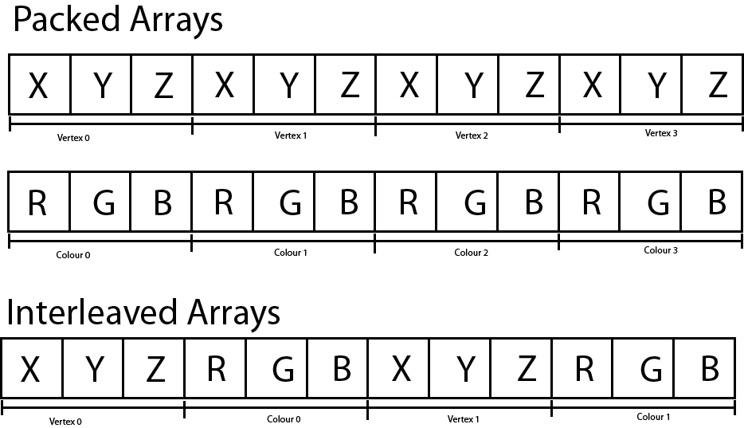

## Rending Pipeline


The image illustrates the various stages of the DirectX 12 rendering pipeline. The blue rectangular blocks represent the fixed-function stages and cannot be modified programmatically. The green rounded-rectangular blocks represent the programmable stages of the graphics pipeline.

---

### Input Assembler

The first stage of the graphics pipeline is the Input-Assembler (IA) stage. The purpose of the input-assembler stage is to read primitive data from user-defined vertex and index buffers and assemble that data into geometric primitives (line lists, triangle strips, or primitives with adjacency data).

---

### Vertex Shader

The Vertex Shader is responsible for transforming the vertices of the object being rendered from object-space to clip-space. The clip-space vertices are required by the (fixed-function) Rasterizer Stage of the rendering pipeline in order to clip the rendering primitives against the view frustum and to compute the per-pixel (or per-fragment) attributes across the face of the rendered primitives. The interpolated vertex attributes are passed to the Pixel Shader in order to compute the final color of the pixel.

The vertex shader can also be used for performing (skeletal) animation or computing per-vertex lighting. The vertex shader takes a single vertex as input and outputs the clip-space position of the vertex. The vertex shader is the only shader stage that is absolutely required in order to define a valid pipeline state object.

The basic concept of a vertex shader is that it receives the vertices that describe a model (expressed in object-space, or model-space) and performs zero or more transformations on the attributes of the vertices in order to produce the vertex attributes for the next stage of the rendering pipeline (this is usually the rasterizer stage but it could also be the geometry or tessellation stages).

A vertex can contain any number of attributes. For example, the vertex position is a possible attribute of a vertex. Vertex color, normal, or texture coordinate are other examples of vertex attributes.

Vertex attributes can be sent to the GPU in either packed or interleaved format. Attributes that are stored in a packed format are usually stored in separate buffers (one buffer for position, another for color, etc..). Packed attributes are similar in concept to a [Struct of Arrays (SoA)](https://en.wikipedia.org/wiki/AOS_and_SOA).

Attributes that are stored in an interleaved format are usually stored in a single array. Interleaved attributes are similar in concept an [Array of Structs (AoS)](https://en.wikipedia.org/wiki/AOS_and_SOA).



---

### Hull Shader

The Hull Shader (HS) stage is an optional shader stage and is responsible for determining how much an input control patch should be tessellated by the tessellation stage.

**Constant Hull Shader**

``` hlsl
struct PatchTess
{
    float EdgeTess[4] : SV_TessFactor;
    float InsideTess[2] : SV_InsideTessFactor;
    // Additional info you want associated per patch.
};

PatchTess ConstantHS(InputPatch<VertexOut, 4> patch, uint patchID : SV_PrimitiveID)
{
PatchTess pt;
// Uniformly tessellate the patch 3 times.
pt.EdgeTess[0] = 3; // Left edge
pt.EdgeTess[1] = 3; // Top edge
pt.EdgeTess[2] = 3; // Right edge
pt.EdgeTess[3] = 3; // Bottom edge
pt.InsideTess[0] = 3; // u-axis (columns)
pt.InsideTess[1] = 3; // v-axis (rows)
return pt;
}
```

The constant hull shader must output the tessellation factors; the tessellation factors depend on the topology of the patch.

Tessellating a quad patch consists of two parts:
1. Four edge tessellation factors control how much to tessellate along each edge.
2. Two interior tessellation factors indicate how to tessellate the quad patch
(one tessellation factor for the horizontal dimension of the quad, and one
tessellation factor for the vertical dimension of the quad).

Tessellating a triangle patch also consists of two parts:
1. Three edge tessellation factors control how much to tessellate along each edge.
2. One interior tessellation factor indicates how much to tessellate the triangle
patch.

If all the tessellation factors are zero, the patch is rejected from further processing.
This allows us to implement optimizations such as frustum culling and backface
culling on a per patch basis.
1. If a patch is not visible by the frustum, then we can reject the patch from
further processing (if we did tessellate it, the tessellated triangles would be
rejected during triangle clipping).
2. If a patch is backfacing, then we can reject the patch from further processing
(if we did tessellate it, the tessellated triangles would be rejected in the backface
culling part of rasterization).

The following are some common metrics used to determine the amount to tessellate:
1. Distance from the camera: The further an object is from the eye, the less
we will notice fine details; therefore, we can render a low-poly version of the
object when it is far away, and tessellate more as it gets closer to the eye.
2. Screen area coverage: We can estimate the number of pixels an object covers
on the screen. If this number is small, then we can render a low-poly version
of the object. As its screen area coverage increases, we can tessellate more.
3. Orientation: The orientation of the triangle with respect to the eye is taken
into consideration with the idea that triangles along silhouette edges will be
more refi ned than other triangles.
4. Roughness: Rough surfaces with lots of details will need more tessellation
than smooth surfaces. A roughness value can be precomputed by examining
the surface textures, which can be used to decide how much to tessellate.

performance advice:
1. If the tessellation factors are 1 (which basically means we are not really
tessellating), consider rendering the patch without tessellation, as we will be
wasting GPU overhead going through the tessellation stages when they are
not doing anything.
2. For performance reasons related to GPU implementations, do not tessellate
such that the triangles are so small they cover less than eight pixels.
3. Batch draw calls that use tessellation (i.e., turning tessellation on and off
between draw calls is expensive).

**Control Point Hull Shader**

The control point hull shader inputs a number of control points and outputs a
number of control points. The control point hull shader is invoked once per control
point output.

``` hlsl
struct HullOut
{
    float3 PosL : POSITION;
};

[domain("quad")]
[partitioning("integer")]
[outputtopology("triangle_cw")]
[outputcontrolpoints(4)]
[patchconstantfunc("ConstantHS")]
[maxtessfactor(64.0f)]
HullOut HS(InputPatch<VertexOut, 4> p, uint i : SV_OutputControlPointID, uint patchId : SV_PrimitiveID)
{
    HullOut hout;
    hout.PosL = p[i].PosL;
    return hout;
}
```

The hull shader inputs all of the control points of the patch via the InputPatch
parameter. The system value SV_OutputControlPointID gives an index identifying
the output control point the hull shader is working on. Note that the input patch
control point count does not need to match the output control point count.

The control point hull shader introduces a number of attributes:
1. domain: The patch type. Valid arguments are tri, quad, or isoline.
2. partitioning: Specifies the subdivision mode of the tessellation.
a. integer: New vertices are added/removed only at integer tessellation factor
values. The fractional part of a tessellation factor is ignored. This creates a
noticeable “popping” when a mesh changes is tessellation level.
b. Fractional tessellation (fractional_even/fractional_odd): New vertices are
added/removed at integer tessellation factor values, but “slide” in gradually
based on the fractional part of the tessellation factor. This is useful when
you want to smoothly transition from a coarser version of the mesh to a
fi ner version through tessellation, rather than abruptly at integer steps. The
difference between integer and fractional tessellation is best understood
by an animation, so the exercises at the end of this chapter will have you
experiment to see the difference first hand.
3. outputtopology: The winding order of the triangles created via subdivision.
a. triangle_cw: clockwise winding order.
b. triangle_ccw: counterclockwise winding order.
c. line: For line tessellation.
4. outputcontrolpoints: The number of times the hull shader executes, outputting
one control point each time. The system value SV_OutputControlPointID gives
an index identifying the output control point the hull shader is working on.
5. patchconstantfunc: A string specifying the constant hull shader function
name.
6. maxtessfactor: A hint to the driver specifying the maximum tessellation factor
your shader uses. This can potentially enable optimizations by the hardware
if it knows this upper bound, as it will know how much resources are needed
for the tessellation. The maximum tessellation factor supported by Direct3D 11 hardware is 64.

---

### Tessellation Stage

The Tessellator Stage is a fixed-function stage that subdivides a patch primitive into smaller primitives according to the tessellation factors specified by the hull shader stage.

---

### Domian Shader

The Domain Shader (DS) stage is an optional shader stage and it computes the final vertex attributes based on the output control points from the hull shader and the interpolation coordinates from the tesselator stage. The input to the domain shader is a single output point from the tessellator stage and the output is the computed attributes of the tessellated primitive.

The tessellation stage outputs all of our newly created vertices and triangles. The domain shader is invoked for each vertex created by the tessellation stage.

With tessellation enabled, whereas the vertex shader acts as a vertex shader for each control point, the hull shader is essentially the vertex shader for the tessellated patch. In particular, it is here that we project the vertices of the tessellated patch to homogeneous clip space.

For a quad patch, the domain shader inputs the tessellation factors (and any other per patch information you output from the constant hull shader), the parametric (u, v) coordinates of the tessellated vertex positions, and all the patch control points output from the control point hull shader. Note that the domain shader does not give you the actual tessellated vertex positions; instead it gives you the parametric (u, v) coordinates of these points in the patch domain space. It is up to you to use these parametric coordinates and the control points to derive the actual 3D vertex positions;

``` hlsl
struct DomainOut
{
    float4 PosH : SV_POSITION;
};
// The domain shader is called for every vertex created by the tessellator.
// It is like the vertex shader after tessellation.
[domain("quad")]
DomainOut DS(PatchTess patchTess, float2 uv : SV_DomainLocation, const OutputPatch<HullOut, 4> quad)
{
    DomainOut dout;
    // Bilinear interpolation.
    float3 v1 = lerp(quad[0].PosL, quad[1].PosL, uv.x);
    float3 v2 = lerp(quad[2].PosL, quad[3].PosL, uv.x);
    float3 p = lerp(v1, v2, uv.y);
    float4 posW = mul(float4(p, 1.0f), gWorld);
    dout.PosH = mul(posW, gViewProj);
    return dout;
}
```
the ordering of the quad patch control points is row-by-row.

---

### Geometry Shader

The Geometry Shader (GS) stage is an optional shader stage that takes a single geometric primitive (a single vertex for a point primitive, three vertices for a triangle primitive, and two vertices for a line primitive) as input and can either discard the primitive, transform the primitive into another primitive type (for example a point to a quad) or generate additional primitives.

While the vertex shader inputs vertices, the geometry shader inputs entire primitives.

The primitives output from the geometry shader are defined by a vertex list. Vertex positions leaving the geometry shader must be transformed to homogeneous clip space. After the geometry shader stage, we have a list of vertices defining primitives in homogeneous clip space. These vertices are projected (homogeneous divide), and then rasterization occurs as usual.

``` hlsl
[maxvertexcount(N)]
void ShaderName(PrimitiveType InputVertexType InputName [NumElements], 
                inout StreamOutputObject<OutputVertexType> OutputName)
{
    // Geometry shader body...
}
```

N is the maximum number of vertices the geometry shader will output for a single invocation. The number of vertices a geometry shader can output per invocation is variable, but it cannot exceed the defined maximum. For performance purposes, maxvertexcount should be as small as possible.

The input parameter is always an array of vertices that define the primitive—one vertex for a point, two for a line, three for a triangle, four for a line with adjacency, and six for a triangle with adjacency.

The input parameter must be prefixed by a primitive type, describing the type of primitives being input into the geometry shader. This can be anyone of the following:
1. point: The input primitives are points.
2. line: The input primitives are lines (lists or strips).
3. triangle: The input primitives triangles (lists or strips).
4. lineadj: The input primitives are lines with adjacency (lists or strips).
5. triangleadj: The input primitives are triangles with adjacency (lists or strips).

The input primitive into a geometry shader is always a complete primitive (e.g., two vertices for a line, and three vertices for a triangle). Thus the geometry shader does not need to distinguish between lists and strips. For example, if you are drawing triangle strips, the geometry shader is still executed for every triangle in the strip, and the three vertices of each triangle are passed into the geometry shader as input. This entails additional overhead, as vertices that are shared by multiple primitives are processed multiple times in the geometry shader.

The output parameter always has the inout modifier. Additionally, the output parameter is always a stream type. A stream type stores a list of vertices which defines the geometry the geometry shader is outputting. A geometry shader adds a vertex to the outgoing stream list using the intrinsic Append method:
``` hlsl
void StreamOutputObject<OutputVertexType>::Append(OutputVertexType v);
```
A stream type is a template type, where the template argument is used to specify the vertex type of the outgoing vertices (e.g., GeoOut). There are three possible stream types:
1. PointStream<OutputVertexType>: A list of vertices defining a point list.
2. LineStream<OutputVertexType>: A list of vertices defining a line strip.
3. TriangleStream<OutputVertexType>: A list of vertices defining a triangle strip.

For lines and triangles, the output primitive is always a strip. Line and triangle lists, however, can be simulated by using the intrinsic RestartStrip method:
``` hlsl
void StreamOutputObject<OutputVertexType>::RestartStrip();
```

If you do not output enough vertices to complete a primitive in a geometry shader, then the partial primitive is discarded.

---

### Stream Output Stage

The Stream Output (SO) stage is an optional fixed-function stage that can be used to feed primitive data back into GPU memory. This data can be recirculated back to the rendering pipeline to be processed by another set of shaders. This is useful for spawning or terminating particles in a particle effect. The geometry shader can discard particles that should be terminated or generate new particles if particles should be spawned.

---

### Rasterizer Stage

The Rasterizer Stage (RS) stage is a fixed-function stage which will clip primitives into the view frustum and perform primitive culling if either front-face or back-face culling is enabled. The rasterizer stage will also interpolate the per-vertex attributes across the face of each primitive and pass the interpolated values to the pixel shader.

---

### Pixel Shader

The Pixel Shader (PS) stage takes the interpolated per-vertex values from the rasterizer stage and produces one (or more) per-pixel color values. The pixel shader can also optionally output a depth value of the current pixel by mapping a single component 32-bit floating-point value to the SV_Depth semantic but this is not a requirement of the pixel shader program. The pixel shader is invoked once for each pixel that is covered by a primitive.

---

### Output Merge

The Output-Merger (OM) stage combines the various types of output data (pixel shader output values, depth values, and stencil information) together with the contents of the currently bound render targets to produce the final pipeline result.

---

### Compute Shader

GPUs have been optimized to process a large amount of memory from a single location or sequential locations (so-called streaming operation); this is in contrast to a CPU designed for random memory accesses.

Using the GPU for non-graphical applications is called general purpose GPU (GPGPU) programming. Not all algorithms are ideal for a GPU implementation; GPUs need data-parallel algorithms to take advantage of the parallel architecture of the GPU. That is, we need a large amount of data elements that will have similar operations performed on them so that the elements can be processed in parallel.

**threads and thread groups**
In GPU programming, the number of threads desired for execution is divided up into a grid of thread groups. A thread group is executed on a single multiprocessor.

Each thread group gets shared memory that all threads in that group can access; a thread cannot access shared memory in a different thread group. Thread synchronization operations can take place amongst the threads in a thread group, but different thread groups cannot be synchronized.

A thread group consists of n threads. The hardware actually divides these threads up into warps (thirty-two threads per warp), and a warp is processed by the multiprocessor in SIMD32 (i.e., the same instructions are executed for the thirty-two threads simultaneously).

In Direct3D, thread groups are launched via the following method call:
``` C++
void ID3D12GraphicsCommandList::Dispatch(UINT ThreadGroupCountX, UINT ThreadGroupCountY, UINT ThreadGroupCountZ);
```
This enables you to launch a 3D grid of thread groups;

``` hlsl
[numthreads(x, y, z)]
void CS(int3 dispatchThreadID : SV_DispatchThreadID)
{
    // Compute shader body...
}
```

1. Each thread group is assigned an ID by the system; this is called the group ID and has the system value semantic SV_GroupID. If Gx  Gy  Gz are the number of thread groups dispatched, then the group ID ranges from (0, 0, 0) to (Gx – 1, Gy – 1, Gz – 1).
2. Inside a thread group, each thread is given a unique ID relative to its group. If the thread group has size X  Y  Z, then the group thread IDs will range from (0, 0, 0) to (X – 1, Y – 1, Z – 1). The system value semantic for the group thread ID is SV_GroupThreadID.
3. A Dispatch call dispatches a grid of thread groups. The dispatch thread ID uniquely identifies a thread relative to all the threads generated by a Dispatch call. In other words, whereas the group thread ID uniquely identifies a thread relative to its thread group, the dispatch thread ID uniquely identifies a thread relative to the union of all the threads from all the thread groups dispatched by a Dispatch call. Let, ThreadGroupSize = (X,Y,Z) be the thread group size, then the dispatch thread ID can be derived from the group ID and the group thread ID as follows: dispatchThreadID.xyz = groupID.xyz * ThreadGroupSize.xyz + groupThreadID.xyz;
4. A linear index version of the group thread ID is given to us by Direct3D through the SV_GroupIndex system value; it is computed as: groupIndex = groupThreadID.z * ThreadGroupSize.x * ThreadGroupSize.y + groupThreadID.y*ThreadGroupSize.x + groupThreadID.x;

Regarding the indexing coordinate order, the first coordinate gives the x-position (or column) and the second coordinate gives the y-position (or row). This is in contrast to common matrix notation, where Mij denotes the element in the ith row and jth column.

**Append and Consume Buffers**

``` hlsl
struct Particle
{
float3 Position;
float3 Velocity;
float3 Acceleration;
};

ConsumeStructuredBuffer<Particle> gInput;
AppendStructuredBuffer<Particle> gOutput;

[numthreads(16, 16, 1)]
void CS()
{
    x// Consume a data element from the input buffer.
    Particle p = gInput.Consume();
    p.Velocity += p.Acceleration*TimeStep;
    p.Position += p.Velocity*TimeStep;
    // Append normalized vector to output buffer.
    gOutput.Append( p );
}

```

Once a data element is consumed, it cannot be consumed again by a different thread; one thread will consume exactly one data element. And again, we emphasize that the order elements are consumed and appended are unknown; therefore, it is generally not the case that the ith element in the input buffer gets written to the ith element in the output buffer. Append structured buffers do not dynamically grow. They must still be large enough to store all the elements you will append to it.

**Shared memory and Synchronization**

Thread groups are given a section of so-called shared memory or thread local storage. Accessing this memory is fast and can be thought of being as fast as a hardware cache. In the compute shader code, shared memory is declared like so: groupshared float4 gCache[256];

The array size can be whatever you want, but the maximum size of group shared memory is 32kb. Because the shared memory is local to the thread group, it is indexed with the SV_ThreadGroupID

A thread could go to access a shared memory element that is not yet initialized because the neighboring threads responsible for initializing those elements have not finished yet. To fix this problem, before the compute shader can continue, it must wait until all the threads have done their texture loading into shared memory. This is accomplished by a synchronization command:

``` hlsl
Texture2D gInput;
RWTexture2D<float4> gOutput;
groupshared float4 gCache[256];
[numthreads(256, 1, 1)]
void CS(int3 groupThreadID : SV_GroupThreadID,
int3 dispatchThreadID : SV_DispatchThreadID)
{
// Each thread samples the texture and stores the
// value in shared memory.
gCache[groupThreadID.x] = gInput[dispatchThreadID.xy];
// Wait for all threads in group to finish.
GroupMemoryBarrierWithGroupSync();
// Safe now to read any element in the shared memory
//and do computation work.
float4 left = gCache[groupThreadID.x - 1];
float4 right = gCache[groupThreadID.x + 1];
...
}
```
