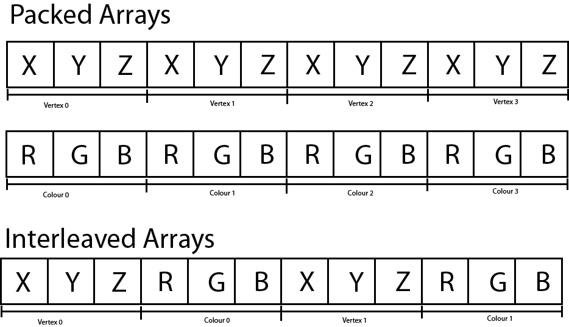
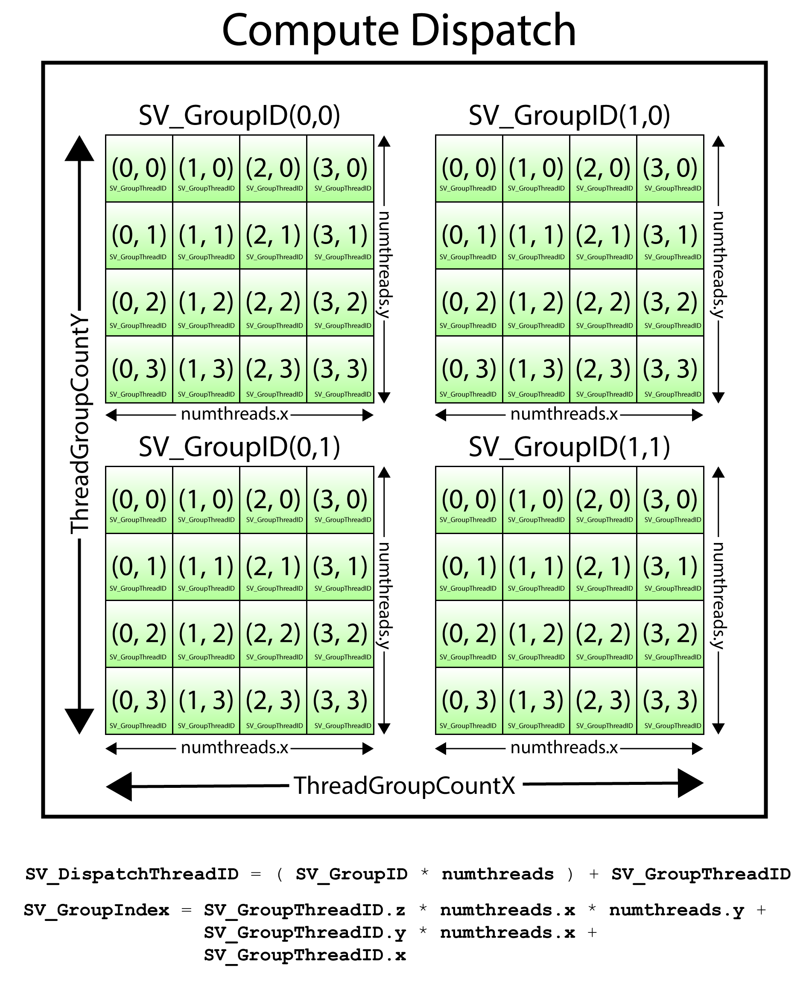

## Rending Pipeline

---

### Input Assembler

---

### Vertex Shader

The Vertex Shader is responsible for transforming the vertices of the object being rendered from object-space to clip-space. The clip-space vertices are required by the (fixed-function) Rasterizer Stage of the rendering pipeline in order to clip the rendering primitives against the view frustum and to compute the per-pixel (or per-fragment) attributes across the face of the rendered primitives. The interpolated vertex attributes are passed to the Pixel Shader in order to compute the final color of the pixel.

The basic concept of a vertex shader is that it receives the vertices that describe a model (expressed in object-space, or model-space) and performs zero or more transformations on the attributes of the vertices in order to produce the vertex attributes for the next stage of the rendering pipeline (this is usually the rasterizer stage but it could also be the geometry or tessellation stages).

A vertex can contain any number of attributes. For example, the vertex position is a possible attribute of a vertex. Vertex color, normal, or texture coordinate are other examples of vertex attributes.

Vertex attributes can be sent to the GPU in either packed or interleaved format. Attributes that are stored in a packed format are usually stored in separate buffers (one buffer for position, another for color, etc..). Packed attributes are similar in concept to a [Struct of Arrays (SoA)](https://en.wikipedia.org/wiki/AOS_and_SOA).

Attributes that are stored in an interleaved format are usually stored in a single array. Interleaved attributes are similar in concept an [Array of Structs (AoS)](https://en.wikipedia.org/wiki/AOS_and_SOA).



---

### Hull Shader

**Constant Hull Shader**

``` hlsl
struct PatchTess
{
    float EdgeTess[4] : SV_TessFactor;
    float InsideTess[2] : SV_InsideTessFactor;
    // Additional info you want associated per patch.
};

PatchTess ConstantHS(InputPatch<VertexOut, 4> patch, uint patchID : SV_PrimitiveID)
{
PatchTess pt;
// Uniformly tessellate the patch 3 times.
pt.EdgeTess[0] = 3; // Left edge
pt.EdgeTess[1] = 3; // Top edge
pt.EdgeTess[2] = 3; // Right edge
pt.EdgeTess[3] = 3; // Bottom edge
pt.InsideTess[0] = 3; // u-axis (columns)
pt.InsideTess[1] = 3; // v-axis (rows)
return pt;
}
```

The constant hull shader must output the tessellation factors; the tessellation factors depend on the topology of the patch.

Tessellating a quad patch consists of two parts:
1. Four edge tessellation factors control how much to tessellate along each edge.
2. Two interior tessellation factors indicate how to tessellate the quad patch
(one tessellation factor for the horizontal dimension of the quad, and one
tessellation factor for the vertical dimension of the quad).

Tessellating a triangle patch also consists of two parts:
1. Three edge tessellation factors control how much to tessellate along each edge.
2. One interior tessellation factor indicates how much to tessellate the triangle
patch.

If all the tessellation factors are zero, the patch is rejected from further processing.
This allows us to implement optimizations such as frustum culling and backface
culling on a per patch basis.
1. If a patch is not visible by the frustum, then we can reject the patch from
further processing (if we did tessellate it, the tessellated triangles would be
rejected during triangle clipping).
2. If a patch is backfacing, then we can reject the patch from further processing
(if we did tessellate it, the tessellated triangles would be rejected in the backface
culling part of rasterization).

The following are some common metrics used to determine the amount to tessellate:
1. Distance from the camera: The further an object is from the eye, the less
we will notice fine details; therefore, we can render a low-poly version of the
object when it is far away, and tessellate more as it gets closer to the eye.
2. Screen area coverage: We can estimate the number of pixels an object covers
on the screen. If this number is small, then we can render a low-poly version
of the object. As its screen area coverage increases, we can tessellate more.
3. Orientation: The orientation of the triangle with respect to the eye is taken
into consideration with the idea that triangles along silhouette edges will be
more refi ned than other triangles.
4. Roughness: Rough surfaces with lots of details will need more tessellation
than smooth surfaces. A roughness value can be precomputed by examining
the surface textures, which can be used to decide how much to tessellate.

performance advice:
1. If the tessellation factors are 1 (which basically means we are not really
tessellating), consider rendering the patch without tessellation, as we will be
wasting GPU overhead going through the tessellation stages when they are
not doing anything.
2. For performance reasons related to GPU implementations, do not tessellate
such that the triangles are so small they cover less than eight pixels.
3. Batch draw calls that use tessellation (i.e., turning tessellation on and off
between draw calls is expensive).

**Control Point Hull Shader**

The control point hull shader inputs a number of control points and outputs a
number of control points. The control point hull shader is invoked once per control
point output.

``` hlsl
struct HullOut
{
    float3 PosL : POSITION;
};

[domain("quad")]
[partitioning("integer")]
[outputtopology("triangle_cw")]
[outputcontrolpoints(4)]
[patchconstantfunc("ConstantHS")]
[maxtessfactor(64.0f)]
HullOut HS(InputPatch<VertexOut, 4> p, uint i : SV_OutputControlPointID, uint patchId : SV_PrimitiveID)
{
    HullOut hout;
    hout.PosL = p[i].PosL;
    return hout;
}
```

The hull shader inputs all of the control points of the patch via the InputPatch
parameter. The system value SV_OutputControlPointID gives an index identifying
the output control point the hull shader is working on. Note that the input patch
control point count does not need to match the output control point count.

The control point hull shader introduces a number of attributes:
1. domain: The patch type. Valid arguments are tri, quad, or isoline.
2. partitioning: Specifies the subdivision mode of the tessellation.
a. integer: New vertices are added/removed only at integer tessellation factor
values. The fractional part of a tessellation factor is ignored. This creates a
noticeable “popping” when a mesh changes is tessellation level.
b. Fractional tessellation (fractional_even/fractional_odd): New vertices are
added/removed at integer tessellation factor values, but “slide” in gradually
based on the fractional part of the tessellation factor. This is useful when
you want to smoothly transition from a coarser version of the mesh to a
fi ner version through tessellation, rather than abruptly at integer steps. The
difference between integer and fractional tessellation is best understood
by an animation, so the exercises at the end of this chapter will have you
experiment to see the difference first hand.
3. outputtopology: The winding order of the triangles created via subdivision.
a. triangle_cw: clockwise winding order.
b. triangle_ccw: counterclockwise winding order.
c. line: For line tessellation.
4. outputcontrolpoints: The number of times the hull shader executes, outputting
one control point each time. The system value SV_OutputControlPointID gives
an index identifying the output control point the hull shader is working on.
5. patchconstantfunc: A string specifying the constant hull shader function
name.
6. maxtessfactor: A hint to the driver specifying the maximum tessellation factor
your shader uses. This can potentially enable optimizations by the hardware
if it knows this upper bound, as it will know how much resources are needed
for the tessellation. The maximum tessellation factor supported by Direct3D 11 hardware is 64.

---

### Tessellation Stage

---

### Domian Shader

The tessellation stage outputs all of our newly created vertices and triangles. The
domain shader is invoked for each vertex created by the tessellation stage.

With tessellation enabled, whereas the vertex shader acts as a vertex shader for each
control point, the hull shader is essentially the vertex shader for the tessellated
patch. In particular, it is here that we project the vertices of the tessellated patch to
homogeneous clip space.

For a quad patch, the domain shader inputs the tessellation factors (and any
other per patch information you output from the constant hull shader), the
parametric (u, v) coordinates of the tessellated vertex positions, and all the patch
control points output from the control point hull shader. Note that the domain
shader does not give you the actual tessellated vertex positions; instead it gives
you the parametric (u, v) coordinates of these points in the patch
domain space. It is up to you to use these parametric coordinates and the control
points to derive the actual 3D vertex positions;

``` hlsl
struct DomainOut
{
    float4 PosH : SV_POSITION;
};
// The domain shader is called for every vertex created by the tessellator.
// It is like the vertex shader after tessellation.
[domain("quad")]
DomainOut DS(PatchTess patchTess, float2 uv : SV_DomainLocation, const OutputPatch<HullOut, 4> quad)
{
    DomainOut dout;
    // Bilinear interpolation.
    float3 v1 = lerp(quad[0].PosL, quad[1].PosL, uv.x);
    float3 v2 = lerp(quad[2].PosL, quad[3].PosL, uv.x);
    float3 p = lerp(v1, v2, uv.y);
    float4 posW = mul(float4(p, 1.0f), gWorld);
    dout.PosH = mul(posW, gViewProj);
    return dout;
}
```
the ordering of the quad patch control points is row-by-row.

---

### Geometry Shader

While the vertex shader inputs vertices, the geometry shader inputs entire primitives.


The primitives output from the geometry shader are defi ned by a vertex
list. Vertex positions leaving the geometry shader must be transformed to
homogeneous clip space. After the geometry shader stage, we have a list of vertices
defi ning primitives in homogeneous clip space. These vertices are projected
(homogeneous divide), and then rasterization occurs as usual.

``` hlsl
[maxvertexcount(N)]
void ShaderName(PrimitiveType InputVertexType InputName [NumElements], 
                inout StreamOutputObject<OutputVertexType> OutputName)
{
    // Geometry shader body...
}
```

N is the maximum number of vertices the geometry shader will output for
a single invocation. The number of vertices a geometry shader can output per
invocation is variable, but it cannot exceed the defined maximum. For performance
purposes, maxvertexcount should be as small as possible.

The input parameter is always an array of vertices that defi ne the primitive—one
vertex for a point, two for a line, three for a triangle, four for a line with adjacency,
and six for a triangle with adjacency.

The input parameter must be prefixed by a primitive type, describing the type of primitives being input
into the geometry shader. This can be anyone of the following:
1. point: The input primitives are points.
2. line: The input primitives are lines (lists or strips).
3. triangle: The input primitives triangles (lists or strips).
4. lineadj: The input primitives are lines with adjacency (lists or strips).
5. triangleadj: The input primitives are triangles with adjacency (lists or strips).

The input primitive into a geometry shader is always a complete primitive (e.g.,
two vertices for a line, and three vertices for a triangle). Thus the geometry shader
does not need to distinguish between lists and strips. For example, if you are
drawing triangle strips, the geometry shader is still executed for every triangle
in the strip, and the three vertices of each triangle are passed into the geometry
shader as input. This entails additional overhead, as vertices that are shared by
multiple primitives are processed multiple times in the geometry shader.

The output parameter always has the inout modifier. Additionally, the output
parameter is always a stream type. A stream type stores a list of vertices which
defines the geometry the geometry shader is outputting. A geometry shader adds
a vertex to the outgoing stream list using the intrinsic Append method:
``` hlsl
void StreamOutputObject<OutputVertexType>::Append(OutputVertexType v);
```
A stream type is a template type, where the template argument is used to specify
the vertex type of the outgoing vertices (e.g., GeoOut). There are three possible
stream types:
1. PointStream<OutputVertexType>: A list of vertices defining a point list.
2. LineStream<OutputVertexType>: A list of vertices defining a line strip.
3. TriangleStream<OutputVertexType>: A list of vertices defining a triangle strip.

For lines and triangles, the output primitive is always a strip. Line
and triangle lists, however, can be simulated by using the intrinsic RestartStrip
method:
``` hlsl
void StreamOutputObject<OutputVertexType>::RestartStrip();
```

If you do not output enough vertices to complete a primitive in a geometry
shader, then the partial primitive is discarded.

---

### Rasterizer Stage

---

### Pixel Shader

The Pixel Shader is responsible for computing the final color of the pixel that is rendered to the screen (or an offscreen render target). It receives the interpolated vertex attributes that are computed by the Rasterizer Stage and usually outputs at least one color value that is written to a render target

---

### Output Merge

---

### Compute Shader

GPUs have been optimized to process a large amount of memory from a single
location or sequential locations (so-called streaming operation); this is in contrast
to a CPU designed for random memory accesses.

Using the GPU for non-graphical applications is called
general purpose GPU (GPGPU) programming. Not all algorithms are ideal for
a GPU implementation; GPUs need data-parallel algorithms to take advantage
of the parallel architecture of the GPU. That is, we need a large amount of data
elements that will have similar operations performed on them so that the elements
can be processed in parallel.

**threads and thread groups**
In GPU programming, the number of threads desired for execution is divided up
into a grid of thread groups. A thread group is executed on a single multiprocessor.

Each thread group gets shared memory that all threads in that group can
access; a thread cannot access shared memory in a different thread group. Thread
synchronization operations can take place amongst the threads in a thread group,
but different thread groups cannot be synchronized.

A thread group consists of n threads. The hardware actually divides these
threads up into warps (thirty-two threads per warp), and a warp is processed by
the multiprocessor in SIMD32 (i.e., the same instructions are executed for the
thirty-two threads simultaneously).

In Direct3D, thread groups are launched via the following method call:
``` C++
void ID3D12GraphicsCommandList::Dispatch(UINT ThreadGroupCountX, UINT ThreadGroupCountY, UINT ThreadGroupCountZ);
```
This enables you to launch a 3D grid of thread groups;

``` hlsl
[numthreads(x, y, z)]
void CS(int3 dispatchThreadID : SV_DispatchThreadID)
{
    // Compute shader body...
}
```

1. Each thread group is assigned an ID by the system; this is called the group ID
and has the system value semantic SV_GroupID. If Gx  Gy  Gz are the number
of thread groups dispatched, then the group ID ranges from (0, 0, 0) to (Gx –
1, Gy – 1, Gz – 1).
2. Inside a thread group, each thread is given a unique ID relative to its group. If
the thread group has size X  Y  Z, then the group thread IDs will range from
(0, 0, 0) to (X – 1, Y – 1, Z – 1). The system value semantic for the group thread
ID is SV_GroupThreadID.
3. A Dispatch call dispatches a grid of thread groups. The dispatch thread ID
uniquely identifies a thread relative to all the threads generated by a Dispatch
call. In other words, whereas the group thread ID uniquely identifies a thread
relative to its thread group, the dispatch thread ID uniquely identifies a thread
relative to the union of all the threads from all the thread groups dispatched
by a Dispatch call. Let, ThreadGroupSize = (X,Y,Z) be the thread group size,
then the dispatch thread ID can be derived from the group ID and the group
thread ID as follows:
dispatchThreadID.xyz = groupID.xyz * ThreadGroupSize.xyz +
groupThreadID.xyz;
4. A linear index version of the group thread ID is given to us by Direct3D
through the SV_GroupIndex system value; it is computed as:
groupIndex = groupThreadID.z*ThreadGroupSize.x*ThreadGroupSize.y +
groupThreadID.y*ThreadGroupSize.x + groupThreadID.x;

Regarding the indexing coordinate order, the first coordinate gives the x-position
(or column) and the second coordinate gives the y-position (or row). This is in
contrast to common matrix notation, where Mij denotes the element in the ith
row and jth column.

**Append and Consume Buffers**

``` hlsl
struct Particle
{
float3 Position;
float3 Velocity;
float3 Acceleration;
};

ConsumeStructuredBuffer<Particle> gInput;
AppendStructuredBuffer<Particle> gOutput;

[numthreads(16, 16, 1)]
void CS()
{
    x// Consume a data element from the input buffer.
    Particle p = gInput.Consume();
    p.Velocity += p.Acceleration*TimeStep;
    p.Position += p.Velocity*TimeStep;
    // Append normalized vector to output buffer.
    gOutput.Append( p );
}

```

Once a data element is consumed, it cannot be consumed again by a different
thread; one thread will consume exactly one data element. And again, we
emphasize that the order elements are consumed and appended are unknown;
therefore, it is generally not the case that the ith element in the input buffer gets
written to the ith element in the output buffer.
Append structured buffers do not dynamically grow. They must still be large
enough to store all the elements you will append to it.

**Shared memory and Synchronization**

Thread groups are given a section of so-called shared memory or thread local
storage. Accessing this memory is fast and can be thought of being as fast as a
hardware cache. In the compute shader code, shared memory is declared like so:
groupshared float4 gCache[256];

The array size can be whatever you want, but the maximum size of group shared
memory is 32kb. Because the shared memory is local to the thread group, it is
indexed with the SV_ThreadGroupID

A thread could go to
access a shared memory element that is not yet initialized because the neighboring
threads responsible for initializing those elements have not finished yet. To fix
this problem, before the compute shader can continue, it must wait until all the
threads have done their texture loading into shared memory. This is accomplished
by a synchronization command:

``` hlsl
Texture2D gInput;
RWTexture2D<float4> gOutput;
groupshared float4 gCache[256];
[numthreads(256, 1, 1)]
void CS(int3 groupThreadID : SV_GroupThreadID,
int3 dispatchThreadID : SV_DispatchThreadID)
{
// Each thread samples the texture and stores the
// value in shared memory.
gCache[groupThreadID.x] = gInput[dispatchThreadID.xy];
// Wait for all threads in group to finish.
GroupMemoryBarrierWithGroupSync();
// Safe now to read any element in the shared memory
//and do computation work.
float4 left = gCache[groupThreadID.x - 1];
float4 right = gCache[groupThreadID.x + 1];
...
}
```


---


### HLSL

**Shader Semantics**

[Semantics](https://msdn.microsoft.com/en-us/library/bb509647(v=vs.85).aspx#System_Value) are a way to tell the Input Assembler how to link the buffer data supplied by the application to the input parameters expected by the shader. Semantics are also the language syntax used to link output parameters from one shader stage to the input parameters to another shader stage.

In an HLSL shader the semantic name for the variable follows the colon (:) character in a variable declaration.

* SV_PrimitiveID
uint primID : SV_PrimitiveID

When this semantic is specified, it tells the input assembler stage to automatically
generate a primitive ID for each primitive. When a draw call is executed to draw
n primitives, the first primitive is labeled 0; the second primitive is labeled 1; and
so on, until the last primitive in the draw call is labeled n-1. The primitive IDs are
only unique for a single draw call.

If a geometry shader is not present, the primitive ID parameter can be added to
the parameter list of the pixel shader. However, if a geometry shader is present, then the primitive ID parameter must
occur in the geometry shader signature. Then the geometry shader can use the
primitive ID or pass it on to the pixel shader stage (or both).

* SV_VertexID
uint vertID : SV_VertexID

For a Draw call, the vertices in the draw call will be labeled with IDs from 0, 1, …,
n-1, where n is the number of vertices in the draw call. For a DrawIndexed call,
the vertex IDs correspond to the vertex index values.


Shader Model 5.1 introduced the ConstantBuffer template construct in order to enable support for descriptor arrays. See [Resource Binding in HLSL](https://docs.microsoft.com/en-us/windows/desktop/direct3d12/resource-binding-in-hlsl#constant-buffers) for more information.


Each invocation of the vertex shader operates over a single vertex (as opposed to triangles or the entire mesh) and outputs the transformed vertex. Many vertices are processed in parallel and it is not possible to modify variables defined within the scope of the vertex shader and expect that other invocations of the vertex shader will see those changes (even if you declare the variable as static in the global scope of the vertex shader!). For example, you cannot declare a counter variable in the vertex shader and allow each invocation to increment that counter to see how many vertices were processed (you may be able to achieve this using atomic counters, but that is beyond the scope of this lesson).

If a 0.0 was used in the last component of the vector, then the vector would be rotated but not translated.
If the vertex attribute is a position vector, then the 4th component of the vector must be a 1.
If the vertex attribute is a normal vector, then the 4th component of the vector must be a 0.
Positional vectors are often referred to as points (because it represents a point in space). Directional vectors are simply referred to as vectors.

the OUT parameter is returned and the result is passed as input to the Rasterizer stage. The rasterizer will use the Position parameter to determine the pixel’s coordinates (in screen space, by applying the viewport), the depth value (in normalized-device coordinate space) which is written to the depth buffer, and the interpolated Color parameter is passed as input to the pixel shader stage.

#### Pixel Shader

The purpose of the pixel shader is to produce the final color that should be written to the currently bound render target(s). The pixel shader can write to a maximum of eight color targets and one depth target.

The pixel shader takes the interpolated color value from the Rasterizer stage and outputs that color to the only bound render target using the [SV_Target](https://msdn.microsoft.com/en-us/library/bb509647(v=vs.85).aspx#System_Value) system value semantic.

``` hlsl
struct PixelShaderInput
{
    float4 Color    : COLOR;
};

float4 main( PixelShaderInput IN ) : SV_Target
{
    return IN.Color;
}
```


### Compute Shaders
A Compute Shader is a programmable shader stage but it cannot be used in a graphics pipeline. Instead, a compute shader must be configured as the only stage of a compute pipeline. Similar to vertex and pixel shaders, a compute shader is defined using HLSL in DirectX but a compute shader does not operate on vertices or pixels. A compute shader is used to create a general purpose program. A compute shader can operate on any data. One of the challenges of writing a compute shader is determining how to organize the data (both input and output) that a compute shader operates on.

### Dispatch
A compute shader is executed as a dispatch. The dispatch can be considered the execution domain of the compute shader. A dispatch is executed using the [ID3D12GraphicsCommandList::Dispatch](https://docs.microsoft.com/en-us/windows/desktop/api/d3d12/nf-d3d12-id3d12graphicscommandlist-dispatch) method. The command list type must be either [D3D12_COMMAND_LIST_TYPE_COMPUTE](https://docs.microsoft.com/en-us/windows/desktop/api/d3d12/ne-d3d12-d3d12_command_list_type) or [D3D12_COMMAND_LIST_TYPE_DIRECT](https://docs.microsoft.com/en-us/windows/desktop/api/d3d12/ne-d3d12-d3d12_command_list_type). A dispatch cannot be executed on a copy command list.

The ID3D12GraphicsCommandList::Dispatch method accepts three parameters: ThreadGroupCountX, ThreadGroupCountY, and ThreadGroupCountZ. This implies that the dispatch defines a 3D domain. The maximum number of thread groups that can be dispatched is 65,535 in each the X, Y, and Z dimension. The name thread group implies that what is being dispatched is a group of threads. The number of threads in a thread group is determined by the numthreads attribute defined in HLSL. A thread group can have a maximum of 1,024 threads (D3D12_CS_THREAD_GROUP_MAX_THREADS_PER_GROUP) and a maximum of 1,024 threads in the X, and Y dimensions but only 64 threads in the Z dimension.

Thread groups are further divided into waves when executed on the GPU. The threads within a wave are executed in lockstep which means that the instructions in a wave are all executed in parallel on a single streaming multiprocessor. The number of threads in a wave is dependent on the GPU vendor. The number of threads in a wave on a NVidia GPU is typically 32 and 64 on an AMD GPU.

There are several System Value Semantics that can be used to query the index of a thread within a compute shader.
* SV_GroupID: The 3D index of the thread group within the dispatch.
* SV_GroupThreadID: The 3D index of the thread within a thread group.
* SV_DispatchThreadID: The 3D index of the thread within the dispatch.
* SV_GroupIndex: The flattened 1D index of the thread within the thread group.
Unfortunately, it is not possible to query the total number of thread groups in a dispatch or the total number of threads in a thread group. The number of groups in a dispatch must be sent as an argument to the compute shader (using a constant buffer or 32-bit constants).



The above image depicts a Dispatch of (2,2,1) thread groups. Each thread group has (4,4,1) threads. In this example, the SV_DispatchThreadID of the last thread in the dispatch is: =(1,1,0)⋅(4,4,1)+(3,3,0)=(4,4,0)+(3,3,0)=(7,7,0) And the SV_GroupIndex of the last thread in the dispatch is: =(0⋅4⋅4)+(3⋅4)+3=0+12+3=15


If there is no geometry shader (geometry shaders are covered in Chapter 12),
then the vertex shader must output the vertex position in homogenous clip space
with the SV_POSITION semantic because this is the space the hardware expects the
vertices to be in when leaving the vertex shader (if there is no geometry shader).
If there is a geometry shader, the job of outputting the homogenous clip space
position can be deferred to the geometry shader.

A vertex shader (or geometry shader) does not do the perspective divide; it just
does the projection matrix part. The perspective divide will be done later by the
hardware .


As a hardware optimization, it is possible that a pixel fragment is rejected by
the pipeline before making it to the pixel shader (e.g., early-z rejection). This is
where the depth test is done fi rst, and if the pixel fragment is determined to be
occluded by the depth test, then the pixel shader is skipped. However, there are
some cases that can disable the early-z rejection optimization. For example, if
the pixel shader modifi es the depth of the pixel, then the pixel shader has to be
executed because we do not really know what the depth of the pixel is before the
pixel shader if the pixel shader changes it.


### Dynamic Indexing

Dynamic indexing is new to shader model 5.1 and and allows us to dynamically
index an array of texture resources, where the textures in this array can be
different sizes and formats. One application of this is to bind all of our texture
descriptors once per frame, and then index into the texture array in the pixel
shader to use the appropriate texture for a given pixel.

We dynamically index into an array of resources in a shader program.
The index can be specified in various ways:
1. The index can be an element in a constant buffer.
2. The index can be a system ID like SV_PrimitiveID, SV_VertexID, SV_
DispatchThreadID, or SV_InstanceID.
3. The index can be the result of come calculation.
4. The index can come from a texture.
5. The index can come from a component of the vertex structure.

we want to minimize the number of descriptors we set on a per render-item basis. Right now we set the object constant buffer, the material constant buffer, and the diffuse texture map SRV on a per render-item basis. Minimizing the number of descriptors we need to set will make
our root signature smaller, which means less overhead per draw call; moreover,
this technique of dynamic indexing will prove especially useful with instancing.

1. Create a structured buffer that stores all of the material data. That is,
instead of storing our material data in constant buffers, we will store it in a
structured buffer. A structured buffer can be indexed in a shader program.
This structured buffer will be bound to the rendering pipeline once per frame
making all materials visible to the shader programs.
2. Add a MaterialIndex field to our object constant buffer to specify the index of
the material to use for this draw call. In our shader programs, we use this to
index into the material structured buffer.
3. Bind all of the texture SRV descriptors used in the scene once per frame,
instead of binding one texture SRV per render-item.
4. Add a DiffuseMapIndex field to the material data that specifies the texture map
associated with the material. We use this to index into the array of textures we
bound to the pipeline in the previous step.
With this setup, we only need to set a per object constant buffer for each renderitem.
Once we have that, we use the MaterialIndex to fetch the material to use for
the draw call, and from that we use the DiffuseMapIndex to fetch the texture to use
for the draw call.

Recall that a structured buffer is just an array of data of some type that can live
in GPU memory and be accessed by shader programs. Because we still need to be
able to update materials on the fly, we use an upload buffer rather than a default
buffer.

### Instancing

Instancing refers to drawing the same object more than once in a scene, but with
different positions, orientations, scales, materials, and textures.

It would be wasteful to duplicate the vertex and index data for each instance.
Instead, we store a single copy of the geometry (i.e., vertex and index lists) relative
to the object’s local space. Then we draw the object several times, but each time
with a different world matrix and a different material if additional variety is
desired.

