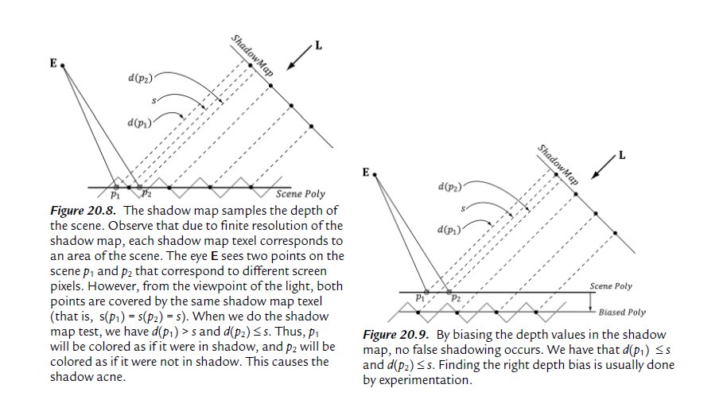
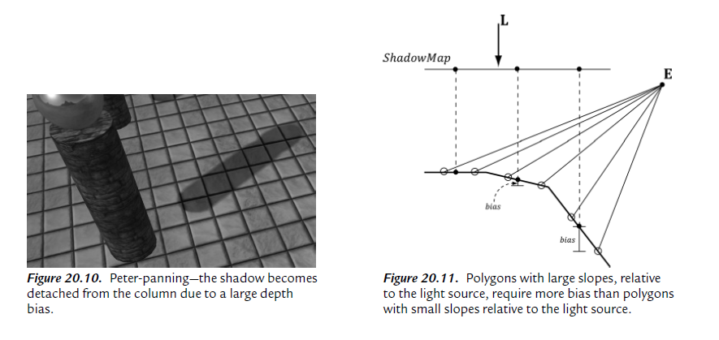
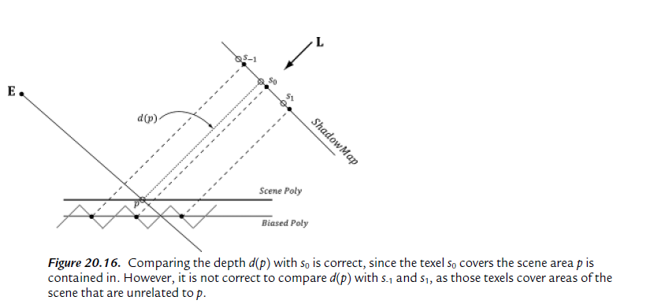

## Shadow Mapping

### Rending Scene Depth

The shadow mapping algorithm relies on rendering the scene depth from the viewpoint of the light source—this is essentially a variation of render-to-texture.

Thus, after we have rendered the scene from the viewpoint of the light source, we will know the pixel fragments nearest to the light source—such fragments cannot be in shadow.

### Orthographic Projection

With an orthographic projection, the lines of projection are parallel to the view space z-axis. And we see that the 2D projection of a vertex (x, y, z) is just (x, y).

As with perspective projection, we want to maintain relative depth information, and we want normalized evice coordinates. To transform the view volume from view space to NDC space, we need to rescale and shift to map the view space view volume $ [-w/2, w/2] \times [-h/2, h/2] \times [n, f] $ to the NDC space view volume $ [-1, 1] \times [-1, 1] \times [0, 1] $.

The orthographic transformation from view space coordinates (x, y, z) to NDC space coordinates (x', y', z') is:

$$
 [x', y', z', 1]=[x, y, z, 1]\left[
 \begin{matrix}
 2/w & 0 & 0 & 0 \\
 0 & 2/h & 0 & 0 \\
 0 & 0 & 1/(f-n) & 0 \\
 0 & 2/h & n/(n-f) & 1
 \end{matrix}
 \right]
$$

The $ 4 \times 4 $ matrix in the above equation is the orthographic projection matrix.

Recall that with the perspective projection transform, we had to split it into two parts: a linear part described by the projection matrix, and a nonlinear part described by the divide by w. In contrast, the orthographic projection transformation is completely linear—there is no divide by w. Multiplying by the orthographic projection matrix takes us directly into NDC coordinates.

### Projective Texture Coordinates

The key to projective texturing is to generate texture coordinates for each pixel in such a way that the applied texture looks like it has been projected onto the geometry. We will call such generated texture coordinates projective texture coordinates.

The texture coordinates (u, v) identify the texel that should be projected onto the 3D point p. But the coordinates (u, v) precisely identify the projection of p on the projection window, relative to a texture space coordinate system on the projection window. So the strategy of generating projective texture coordinates is as follows:

1. Project the point p onto the light’s projection window and transform the coordinates to NDC space. This step can be implemented by thinking of the light projector as a camera.
2. Transform the projected coordinates from NDC space to texture space, thereby effectively turning them into texture coordinates.

$$
 [x, y, 0, 1]\left[
 \begin{matrix}
 0.5 & 0 & 0 & 0 \\
 0 & -0.5 & 0 & 0 \\
 0 & 0 & 1 & 0 \\
 0.5 & 0.5 & 0 & 1
 \end{matrix}
 \right]=[u, v, 0, 1]
$$

Let us call the above matrix T for “texture matrix” that transforms from NDC space to texture space.

### Shadow Mapping

The idea of the shadow mapping algorithm is to render-to-texture the scene depth from the viewpoint of the light into a depth buffer called a shadow map. After this is done, the shadow map will contain the depth values of all the visible pixels from the perspective of the light. (Pixels occluded by other pixels will not be in the shadow map because they will fail the depth test and either be overwritten or never written.)

To render the scene from the viewpoint of the light, we need to defi ne a light view matrix that transforms coordinates from world space to the space of the light and a light projection matrix, which describes the volume that light emits through in the world. This can be either a frustum volume (perspective projection) or box volume (orthographic projection). A frustum light volume can be used to model spotlights by embedding the spotlight cone inside the frustum. A box light volume can be used to model parallel lights.

Once we have built the shadow map, we render the scene as normal from the perspective of the “player” camera. For each pixel p rendered, we also compute its depth from the light source, which we denote by d(p). In addition, using projective texturing, we sample the shadow map along the line of sight from the light source to the pixel p to get the depth value s(p) stored in the shadow map; this value is the depth of the pixel closest to the light along the line of sight from the position of the light to p. Hence a pixel is not in shadow if and only if d(p) $ \leq $ s(p).

#### Depth Bias



A simple solution is to apply a constant bias to offset the shadow map depth.
Too much biasing results in an artifact called peter-panning, where the shadow appears to become detached from the object.

Unfortunately, a fixed bias does not work for all geometry. In particular, triangles with large slopes (with respect to the light source) need a larger bias.



What we want is a way to measure the polygon slope with respect to the light source, and apply more bias for larger sloped polygons. Fortunately, graphics hardware has intrinsic support for this via the so-called slope-scaled-bias rasterization state properties. See [D3D12_RASTERIZER_DESC](https://learn.microsoft.com/en-us/windows/win32/api/d3d12/ns-d3d12-d3d12_rasterizer_desc):

For the complete details of depth bias, see [Depth Bias](https://learn.microsoft.com/en-us/windows/win32/direct3d11/d3d10-graphics-programming-guide-output-merger-stage-depth-bias)

### PCF

The projective texture coordinates (u, v) used to sample the shadow map generally will not coincide with a texel in the shadow map. Usually, it will be between four texels. With color texturing, this is solved with bilinear interpolation. However, we should not average depth values, as it can lead to incorrect results about a pixel being flagged in shadow. (For the same reason, we also cannot generate mipmaps for the shadow map.) Instead of interpolating the depth values, we interpolate the results—this is called **percentage closer filtering** (PCF). That is, we use point filtering (MIN_MAG_MIP_POINT) and sample the texture with coordinates $ (u, v), (u + \Delta x, v), (u, v + \Delta x), (u + \Delta x, v + \Delta x) $, where $ \Delta x $ = 1 / SHADOW_MAP_SIZE. Since we are using point sampling, these four points will hit the nearest four texels s0, s1, s2, and s3, respectively, surrounding (u, v). We then do the shadow map test for each of these sampled depths and bilinearly interpolate the shadow map results:

``` hlsl
static const float SMAP_SIZE = 2048.0f;
static const float SMAP_DX = 1.0f / SMAP_SIZE;
...
// Sample shadow map to get nearest depth to light.
float s0 = gShadowMap.Sample(gShadowSam, projTexC.xy).r;
float s1 = gShadowMap.Sample(gShadowSam, projTexC.xy + float2(SMAP_DX, 0)).r;
float s2 = gShadowMap.Sample(gShadowSam, projTexC.xy + float2(0, SMAP_DX)).r;
float s3 = gShadowMap.Sample(gShadowSam, projTexC.xy + float2(SMAP_DX, SMAP_DX)).r;
// Is the pixel depth <= shadow map value?
float result0 = depth <= s0;
float result1 = depth <= s1;
float result2 = depth <= s2;
float result3 = depth <= s3;
// Transform to texel space.
float2 texelPos = SMAP_SIZE * projTexC.xy;
// Determine the interpolation amounts.
float2 t = frac(texelPos);
// Interpolate results.
return lerp(lerp(result0, result1, t.x), lerp(result2, result3, t.x), t.y);
```

In this way, it is not an all-or-nothing situation; a pixel can be partially in shadow. For example, if two of the samples are in shadow and two are not in shadow, then the pixel is 50% in shadow. This creates a smoother transition from shadowed pixels to non-shadows pixels.

The main disadvantage of PCF filtering as described above is that it requires four texture samples. Sampling textures is one of the more expensive operations on a modern GPU because memory bandwidth and memory latency have not improved as much as the raw computational power of GPUs. Fortunately, Direct3D 11+ graphics hardware has built in support for PCF via the SampleCmpLevelZero method:
``` hlsl
Texture2D gShadowMap : register(t0);
SamplerComparisonState gsamShadow : register(s0);

// Complete projection by doing division by w.
shadowPosH.xyz /= shadowPosH.w;
// Depth in NDC space.
float depth = shadowPosH.z;
// Automatically does a 4-tap PCF.
gShadowMap.SampleCmpLevelZero(gsamShadow, shadowPosH.xy, depth).r;
```

The LevelZero part of the method name means that it only looks at the top mipmap level, which is fine because that is what we want for shadow mapping (we do not generate a mipmap chain for the shadow map).

So far in this section, we used a 4-tap PCF kernel. Larger kernels can be used to make the edges of shadows larger and even smoother, at the expensive of extra SampleCmpLevelZero calls. Since each SampleCmpLevelZero call performs a 4-tap PCF, we are using 4 $ \times $ 4 unique sample points from the shadow map (based on our pattern there is some overlap of sample points). Using large filtering kernels can cause the shadow acne problem to return;

An observation is that PCF really only needs to be performed at the shadow edges. Inside the shadow, there is no blending, and outside the shadow there is no blending. Based on this observation, methods have been devised to only do PCF at the shadow edges. [Isidoro06b] describes one way to do this. Such a technique requires a dynamic branch in the shader code: “If we are on a shadow edge, do expensive PCF, otherwise just take one shadow map sample.” Note that the extra expensive of doing such a method makes it only worthwhile if your PCF kernel is large (say 5 $ \times $ 5 or greater); however, this is just general advice and you will need to profi le to verify the cost/benefit. One final remark is that your PCF kernel need not be a box filter grid. Manyarticles have been written about randomly picking points to be in the PCF kernel.

#### Large PCF Kernel

Refer to Figure 20.16, where we are computing the shadow test for a pixel p visible by the eye. With no PCF, we compute the distance d = d(p) and compare it to the corresponding shadow map value $ s_0 = s(p) $. With PCF, we also compare neighboring shadow map values s-1 and s1 against d. However, it is not valid to compare d with $ s_{-1} $ and $ s_1 $ . The texels $ s_{-1} $ and $ s_1 $ describe the depths of different areas of the scene that may or may not be on the same polygon as p.

$ lit_0 = d \leq s_0 (true) $
$ lit_{-1} = d \leq s_{-1} (true) $
$ lit_1 = d \leq s_1 (false) $

When the results are interpolated, we get that p is is 1/3rd in shadow, which is incorrect as nothing is occluding p.



Observe that more depth biasing would fix the error. However, in this example, we are only sampling the next door neighbor texels in the shadow map. If we widen the PCF kernel, then even more biasing is needed. Thus for small PCF kernels, simply doing the depth bias is enough to counter this problem and it is nothing to worry about. But for large PCF kernels such as 5 $ \times $ 5 or 9 $ \times $ 9, which are used to make soft shadows, this can become a real problem.

The solution we describe is from [Tuft10]. The strategy is to make the assumption the neighboring pixels of p lie on the same plane as p. This assumption is not always true, but it is the best we have to work with.

Let p = (u, v, z) be the coordinates in light space. The coordinates (u, v) are used to index into the shadow map, and the value z is the distance from the light source used in the shadow map test. We can compute the vectors $ \frac{\partial p}{\partial x} = ( \frac{\partial u}{\partial x}, \frac{\partial v}{\partial x}, \frac{\partial z}{\partial x} ) $ and $ \frac{\partial p}{\partial y} = ( \frac{\partial u}{\partial y}, \frac{\partial v}{\partial y}, \frac{\partial z}{\partial y} ) $ with ddx and ddy, which lie in the tangent plane of the polygon. This tells us how we move in light space when we move in screen space. In particular, if we move $ (\Delta x, \Delta y) $ units in screen space, we move $ \Delta x( \frac{\partial u}{\partial x}, \frac{\partial v}{\partial x}, \frac{\partial z}{\partial x} ) + \Delta y( \frac{\partial u}{\partial y}, \frac{\partial v}{\partial y}, \frac{\partial z}{\partial y} ) $ units in light space in the directions of the tangent vectors. Ignoring the depth term for the moment, if we move $ (\Delta x, \Delta y) $ units in screen space, we move $ \Delta x( \frac{\partial u}{\partial x}, \frac{\partial v}{\partial x} ) + \Delta y( \frac{\partial u}{\partial y}, \frac{\partial v}{\partial y} ) $ units in light space on the uv-plane; this can be expressed by the matrix equation:

$$
 [\Delta x, \Delta y]
 \left[
    \begin{matrix}
        \frac{\partial u}{\partial x} & \frac{\partial v}{\partial x} \\
        \frac{\partial u}{\partial y} & \frac{\partial v}{\partial y}      
    \end{matrix}
 \right]
 = \Delta x(\frac{\partial u}{\partial x}, \frac{\partial v}{\partial x}) + 
 \Delta y(\frac{\partial u}{\partial y}, \frac{\partial v}{\partial y})
 = [\Delta u, \Delta v] 
$$

Therefore,

$$
 [\Delta x, \Delta y]=[\Delta u, \Delta v]
 \left[
    \begin{matrix}
        \frac{\partial u}{\partial x} & \frac{\partial v}{\partial x} \\
        \frac{\partial u}{\partial y} & \frac{\partial v}{\partial y}      
    \end{matrix}
 \right]^{-1} = 
 [\Delta u, \Delta v]
 \frac{1}{\frac{\partial u}{\partial x}\frac{\partial v}{\partial y}-\frac{\partial v}{\partial x}\frac{\partial u}{\partial y}}
 \left[
    \begin{matrix}
        \frac{\partial v}{\partial y} & -\frac{\partial v}{\partial x} \\
        -\frac{\partial u}{\partial y} & \frac{\partial u}{\partial x}      
    \end{matrix}
 \right]
$$

This new equation tells us that if we move $(\Delta u, \Delta v)$ units in light space on the
uv-plane, then we move $(\Delta x, \Delta y)$ units in screen space. 

Now, let us return to the depth term we have been ignoring. If we move
$(\Delta x, \Delta y)$ units in screen space, then the light space depth moves by $ \Delta z = \Delta x\frac{\partial z}{\partial x} + \Delta y\frac{\partial z}{\partial y} $.

Thus, when we offset our texture coordinates to do the PCF, we can modify the
depth value used in the depth test accordingly: $ z' = z + \Delta z $

Let us summarize:
1. In our PCF implementation, we offset our texture coordinates to sample neighboring values in the shadow map. So for each sample, we know $ (\Delta u, \Delta v) $.
2. We can use the above equation to find the screen space offset $ (\Delta x, \Delta y) $ when we offset $ (\Delta u, \Delta v) $ units in light space.
3. With $ (\Delta x, \Delta y) $ solved for, apply $ \Delta z = \Delta x\frac{\partial z}{\partial x} + \Delta y\frac{\partial z}{\partial y} $ to figure out the light space depth change.

**An Alternative Solution to the Large PCF Kernel Problem**

We can conclude that u = u(x, y), v = v(x, y) and z = z(x, y) are all functions of x and y. However, we can also think of z as a function of u and v (i.e., z = z(u, v)).

$ \frac{\partial z}{\partial x} = \frac{\partial z}{\partial u}\frac{\partial u}{\partial x} + \frac{\partial z}{\partial v}\frac{\partial v}{\partial x} $

$ \frac{\partial z}{\partial y} = \frac{\partial z}{\partial u}\frac{\partial u}{\partial y} + \frac{\partial z}{\partial v}\frac{\partial v}{\partial y} $

Therefore,

$$
 [\frac{\partial z}{\partial x}, \frac{\partial z}{\partial y}]
 =[\frac{\partial z}{\partial u}, \frac{\partial z}{\partial v}]
 \left[
    \begin{matrix}
        \frac{\partial u}{\partial x} & \frac{\partial u}{\partial y} \\
        \frac{\partial v}{\partial x} & \frac{\partial v}{\partial y}
    \end{matrix}
 \right]
$$

$$
 [\frac{\partial z}{\partial u}, \frac{\partial z}{\partial v}]=
 [\frac{\partial z}{\partial x}, \frac{\partial z}{\partial y}]
 \left[
    \begin{matrix}
        \frac{\partial u}{\partial x} & \frac{\partial u}{\partial y} \\
        \frac{\partial v}{\partial x} & \frac{\partial v}{\partial y}
    \end{matrix}
 \right]^{-1}=
 [\frac{\partial z}{\partial x}, \frac{\partial z}{\partial y}]
 \frac{1}{\frac{\partial u}{\partial x}\frac{\partial v}{\partial y}
 -\frac{\partial u}{\partial y}\frac{\partial v}{\partial x}}
 \left[
    \begin{matrix}
        \frac{\partial v}{\partial y} & -\frac{\partial u}{\partial y} \\ 
        -\frac{\partial v}{\partial x} & \frac{\partial u}{\partial x}
    \end{matrix}
 \right]
$$

We now have solved for $ \frac{\partial z}{\partial u} $ and $ \frac{\partial z}{\partial y} $ directly (everything on the right-side of the equation is known). If we move $(\Delta u, \Delta v)$ units in light space on the uv-plane, then the light space depth moves by $ \Delta z = \Delta u\frac{\partial z}{\partial u} + \Delta v\frac{\partial z}{\partial v} $. So with this approach, we do not have to transform to screen space, but can stay in light space.