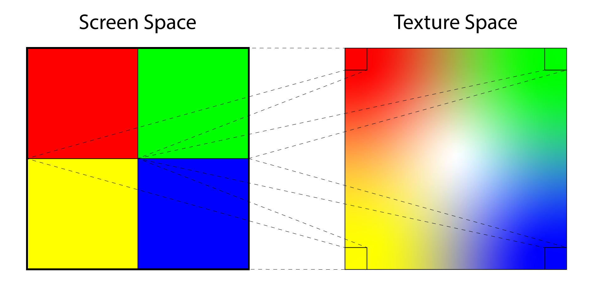
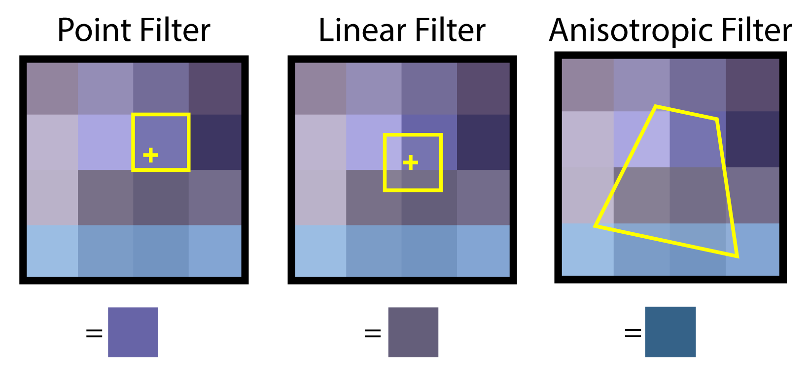
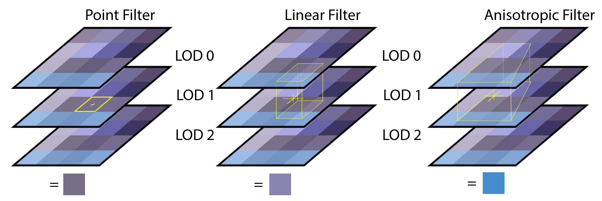
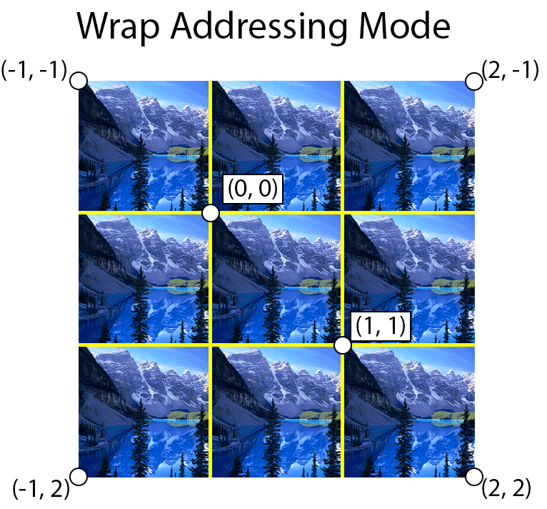
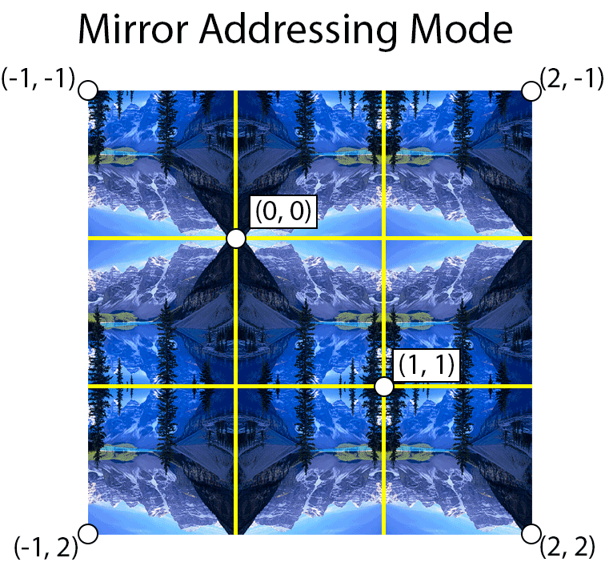
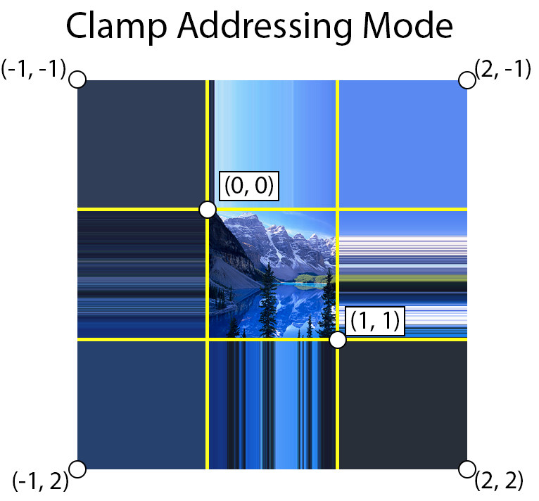
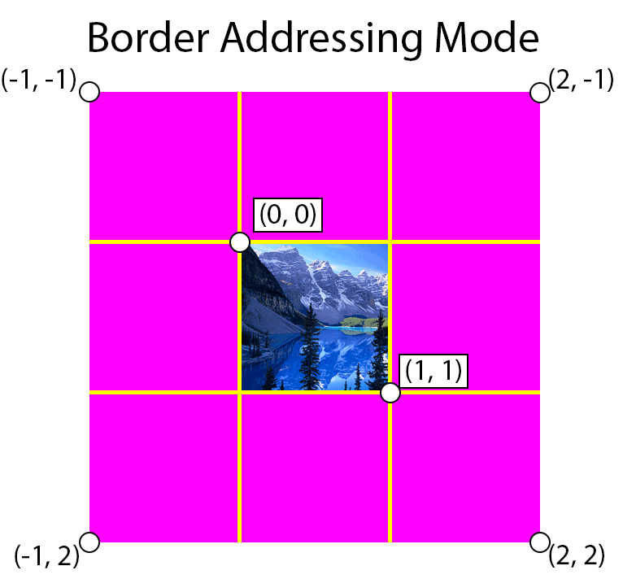
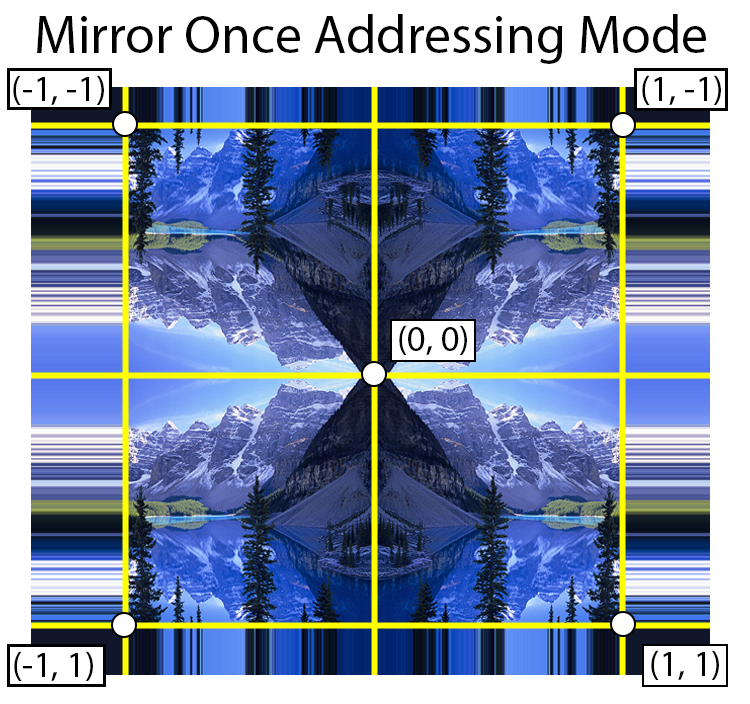
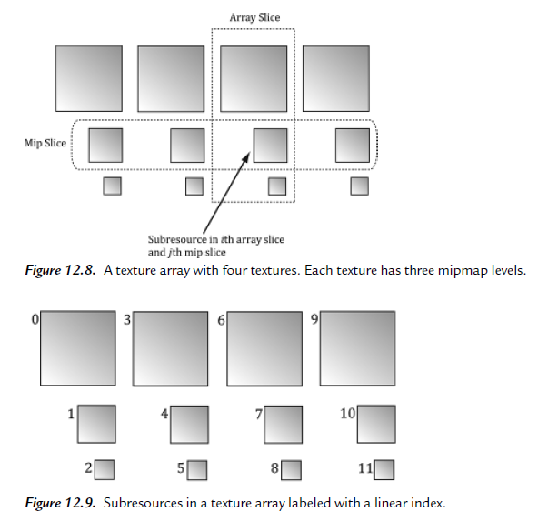

## Texturing

Texturing is the process of mapping a 1D, 2D or 3D image onto a 3D object. Textures can be used to store more than just (albedo) color information about an object.

A **pixel** is commonly refers to a **picture element**. In computer graphics, a pixel usually refers to a single point on the screen (and digital screens are usually measured by their pixel resolution). A **texel** is a **texture element** and refers to a single point in a texture.

A texture can be bound to different stages of the rendering pipeline; a common
example is to use a texture as a render target (i.e., Direct3D draws into the texture)
and as a shader resource (i.e., the texture will be sampled in a shader). A texture
can also be used as both a render target and as a shader resource, but not at the
same time. Rendering to a texture and then using it as a shader resource, a method
called **render-to-texture**.

We can place several unrelated images on one big
texture map (this is called a texture atlas), and use it for several different objects.
The texture coordinates are what will determine what part of the
texture gets mapped on the triangles.

### Texture Coordinates

A **texture coordinate** is used to determine the position within the texture to sample from. When sampling from the texture, the texture coordinate (in each dimension of the texture) is usually normalized in the range [0⋯1] where (0,0) is the top-left of the texture and (1,1) is the bottom-right of the texture. The address mode determines how the texture is sampled when the texture coordinate is outside the range [0⋯1].

OpenGL flips the V texture coordinate. The bottom-left of the texture is at (0,0) and the top-right is at (1,1) in OpenGL.

### Mipmapping

Mipmapping is the process of generating a series of images from a texture where each images in the series is half the size of the previous image. This is also referred to as a **mipmap chain**.

The number of images in the mipmap chain is log2(n) where n is the number of texels on the longest dimension (maximum of either width or height) of the original texture. The halving of image stops when both the width and height of the resulting LOD level is 1. That is, the resolution of the image at the highest LOD level is 1×1.

Mipmapping works best with power of two textures. A power of two texture has dimensions that are powers of two in both the width and height of the texture. A power of two value can be halved until it reaches 1 without getting any odd or fractional values. For example, a texture that is 1024×1024 (2^10) can be halved exactly 10 times before reaching the highest LOD level resulting in a total of 11 mips (LOD 0 – 10).

When a texture is not exactly a power of two, then at least one LOD in the mipmap chain will have an odd size (for example 5×5) which results in the next image in the mipmap chain being less than half of the previous image (in this case, the next image in the mipmap chain will have a size of 2×2). If this is not taken into consideration during mipmap generation then the resulting mipmap could contain visual artifacts that will cascade into higher level mipmaps. This issue will be addressed in the compute shader that performs mipmap generation.

The primary benefit of mipmapping is seen in the improved filtering when viewing the texture from far away. Without mipmapping, visible artifacts appear in the rendered image in the form of noise.

### Undersampling 
Undersampling occurs when a single screen pixel maps to multiple texels in the texture. If all of the texels that are covering the screen pixel are not taken into consideration during rendering, then the image will appear noisy since neighboring pixels in screen space can be far apart in texture space resulting in a rapid changes in color across neighboring screen pixels.



The image above demonstrates the issue that occurs when the texture is not mipmapped. On the left side of the image are four screen pixels. On the right is the texture that is being sampled to produce the color of each pixel. If the texture is sufficiently far away from the viewer then the resulting pixel colors will be very different from each other resulting in visible noise in the rendered image. Without mipmapping, the only way to resolve this issue is to sample more texels per screen pixel and blend the sampled texels to produce the final color. But how many texels from the texture should be sampled? The number of texels to sample from the texture to produce the correct color is dependent on the area of the texture that is being covered by the screen pixel. If the entire texture can fit in a the space of a single screen pixel (this can happen if the object being rendered is very far away from the viewer) then every single texel in the texture needs to be sampled to produce the correct result. A 512×512 texture would require 262,144 samples (for each screen pixel) to produce the correct color. Obviously this is not practical so pre-filtering the texture using mipmapping provides a solution to this problem.

Besides the improved image quality the other benefit of mipmapping is texture caching. When multiple screen pixels all sample from the same area in texture space then the results can be cached in high speed memory. When the pixels are sampling from a higher mipmap level (depending on the amount of cache memory) then the entire mipmap level can be stored in high speed cache and future samples from that texture are extremely fast relative to sampling from global texture memory. If the texture is not mipmapped then it can be the case that different pixels are sampling from the texture that are not close together (as demonstrated in the image above) and in that case, every sample from the texture will invalidate the cache forcing the texture sampler to fetch data from the global texture memory.

### Sampler

[D3D12_SAMPLER_DESC](https://learn.microsoft.com/en-us/windows/win32/api/d3d12/ns-d3d12-d3d12_sampler_desc)

There are several options that the graphics programmer can specify which have an impact on how the texture is sampled. These options include filtering, address modes, LOD bias and LOD clamping, comparison function, and border color.

#### Filter

The filter option of the texture sampler determines how the fetched texel is blended with its neighboring pixels to produce the final color. There are three filtering methods: point, linear, and anisotropic.

##### Minification and Magnification



* Point Filtering
Point filtering will return the color of the closest texel to the point being sampled. This is the cheapest sampling method because it only performs a single read from the texture and does not perform any blending between neighboring texels. 
* Linear Filtering
Linear filtering will apply a bi-linear blend between the closest texels to the sampled sub-texel using the distance to the center of the texel as the weight used to blend the texels to obtain the final texel. 
* Anisotropic Filtering
Anisotropic filtering samples the texels in the texture using a sampling pattern that more closely matches the pixel coverage in texture space. If a rendered triangle appears at an oblique angle to the viewer then more texels that appear further away from the viewer are sampled than the ones that are close to the viewer. Anisotropic filtering is relatively expensive and should only be used when rendering surfaces that appear at oblique angles to the viewer such as ground and terrain textures.

##### Mipmap Filtering



* Point Filtering
Pick and use the mipmap level that best matches the projected screen geometry resolution for texturing.
* Linear Filtering
Pick the two nearest mipmap levels that best match the projected screen geometry resolution for texturing (one will be bigger and one will be smaller than the screen geometry resolution).
* Anisotropic Filtering
Anisotropic filtering samples from the two closest mipmaps using a pattern that matches the covered texels.

#### Address Mode
Texture addressing modes allows you to specify how to handle texture coordinates that are outside of the range [0⋯1]. There are currently five different address modes in DirectX 12; wrap, mirror, clamp, border, and mirror once.

* Wrap

The wrap address mode will tile the texture at whole number boundaries. This is performed by simply taking the fractional component of the texture coordinate.
```
if texCoord > 1 then
    texCoord = fractional_part(texCoord)
else if texCoord < 0 then
    texCoord = 1 - fractional_part(texCoord)
end if
```


* Mirror

The mirror texture address mode will flip the UV coordinates at every integer boundary. For example, texture coordinates in the range [0⋯1] are treated normally but texture coordinates in the range (1⋯2] are flipped (by subtracting the fractional part of the texture coordinate by 1) and texture coordinates in the range (2⋯3] will be treated normally again.
```
if texCoord is odd then
    texCoord = 1 - fractional_part(texCoord)
else
    texCoord = fractional_part(texCoord)
end if
```


* Clamp

Using clamp address mode, texture coordinates are clamped in the range [0⋯1].
```
if texCoord > 1 then
    texCoord = 1
else if texCoord < 0 then
    texCoord = 0
end if
```


* Border

Border addressing mode uses a specified border color when the texture coordinates are outside of the range [0⋯1].
```
if texCoord < 0 or texCoord > 1 then
    return borderColor
end if
```


* Mirror Once

The mirror once address mode takes the absolute value of the texture coordinate and clamps the value to 1.
```
texCoord = abs(texCoord)
if texCoord > 1 then
    texCoord = 1
end if
```


### Sampler Object

[ID3D12Device::CreateSampler](https://learn.microsoft.com/en-us/windows/win32/api/d3d12/nf-d3d12-id3d12device-createsampler)

#### Static Sampler

[D3D12_STATIC_SAMPLER_DESC](https://learn.microsoft.com/en-us/windows/win32/api/d3d12/ns-d3d12-d3d12_static_sampler_desc)

[D3D12_ROOT_SIGNATURE_DESC](https://learn.microsoft.com/en-us/windows/win32/api/d3d12/ns-d3d12-d3d12_root_signature_desc)

### Shader

Now, given a pair of texture coordinate (u, v) for a pixel in the pixel shader, we
actually sample a texture using the Texture2D::Sample method:

``` hlsl
Texture2D gTexture : register(t0);
SamplerState gSampler : register(s0);

float4 components = gTexture.Sample(gSampler, TexCoord);
```

``` C++
D3D12_SHADER_RESOURCE_VIEW_DESC::Shader4ComponentMapping = D3D12_DEFAULT_SHADER_4_COMPONENT_MAPPING;
```

### Transforming Texture

1. Scale: A brick texture is stretched along a wall. The wall vertices currently have
texture coordinates in the range [0, 1]. We scale the texture coordinates by 4 to
scale them to the range [0, 4], so that the texture will be repeated four-by-four
times across the wall.
2. Translation: We have cloud textures stretches over a clear blue sky. By translating the
texture coordinates as a function of time, the clouds are animated over the sky.
3. Rotation: Texture rotation is sometimes useful for particle like effects, where we rotate a
fireball texture over time, for example.

We use two separate texture transformation matrices gTexTransform and
gMatTransform because sometimes it makes more sense for the material to
transform the textures (for animated materials like water), but sometimes it
makes more sense for the texture transform to be a property of the object.

### Texture Array
A texture array stores an array of textures. In C code, a texture array is
represented by the ID3D12Resource interface just like all resources are (textures
and buffers). When creating an ID3D12Resource object, there is actually a
property called DepthOrArraySize that can be set to specify the number of texture elements the texture stores (or the depth for a 3D texture).

In a HLSL file,
a texture array is represented by the Texture2DArray type:
Texture2DArray TexArray;
Now, you have be wondering why we need texture arrays. Why not just do this:
Texture2D TexArray[4];
In shader model 5.1 (new to Direct3D 12), we actually can do this. However, this
was not allowed in previous Direct3D versions. Moreover, indexing textures like
this may have a little overhead depending on the hardware.

When using a texture array, three texture coordinates are required. The first
two texture coordinates are the usual 2D texture coordinates; the third texture
coordinate is an index into the texture array.

### Texture Subresource

In turn, each texture has
its own mipmap chain. The Direct3D API uses the term *array slice* to refer to an
element in a texture along with its complete mipmap chain. The Direct3D API uses
the term *mip slice* to refer to all the mipmaps at a particular level in the texture array.
A subresource refers to a single mipmap level in a texture array element.



The following utility function is used to compute the linear subresource index
given the mip level, array index, and the number of mipmap levels:
``` C++
inline UINT D3D12CalcSubresource(UINT MipSlice, UINT ArraySlice, UINT PlaneSlice, UINT MipLevels, UINT ArraySize)
{
    return MipSlice + ArraySlice * MipLevels + PlaneSlice * MipLevels * ArraySize;
}
```

### MSAA

MSAA executes the pixel shader once per pixel,
at the pixel center, and then shares that color information with its subpixels based
on visibility (the depth/stencil test is evaluated per subpixel) and coverage (does the
subpixel center lie inside or outside the polygon?).

### Alpha-To-Coverage

When MSAA is enabled, and alpha-to-coverage is enabled (a member of
D3D12_BLEND_DESC::AlphaToCoverageEnable = true), the hardware will look at
the alpha value returned by the pixel shader and use that to determine coverage