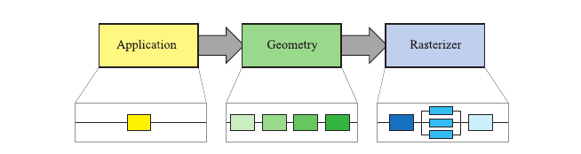
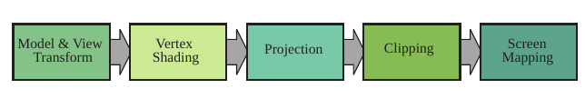
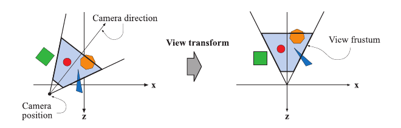
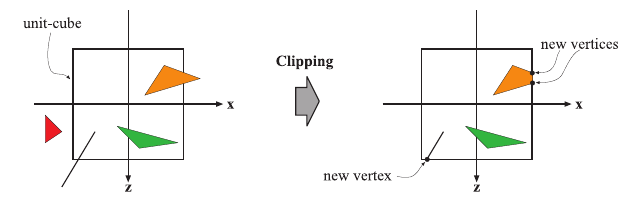
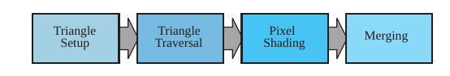

## The Graphics Rendering Pipeline

The main function of the pipeline is to generate, or render, a two-dimensional image, given a virtual camera, three-dimensional objects, light sources, shading equations, textures, and more.

### Architecture

A coarse division of the real-time rendering pipeline into three conceptual stages: *application*, *geometry*, and *rasterizer*.

Each of these stages is usually a pipeline in itself, which means that it consists of several substages. We differentiate between the conceptual stages (application, geometry, and rasterizer), functional stages, and pipeline stages. A functional stage has a certain task to perform but does not specify the way that task is executed in the pipeline. A pipeline stage, on the other hand, is executed simultaneously with all the other pipeline stages. A pipeline stage may also be parallelized in order to meet high performance needs. For example, the geometry stage may be divided into five functional stages, but it is the implementation of a graphics system that determines its division into pipeline stages. A given implementation may combine two functional stages into one pipeline stage, while it divides another, more time-consuming, functional stage into several pipeline stages, or even parallelizes it.

It is the slowest of the pipeline stages that determines the rendering speed, the update rate of the images. Assume that our output device’s maximum update frequency is 60 Hz, and that the bottleneck of the rendering pipeline has been found. Timings show that this stage takes 62.5 ms to execute. The rendering speed is then computed as follows. First, ignoring the output device, we get a maximum rendering speed of 1/0.0625 = 16 fps. Second, adjust this value to the frequency of the output device: 60 Hz implies that rendering speed can be 60 Hz, 60/2 = 30 Hz, 60/3 = 20 Hz, 60/4 = 15 Hz, 60/5 = 12 Hz, and so forth. This means that we can expect the rendering speed to be 15 Hz, since this is the maximum constant speed the output device can manage that is less than 16 fps.

#### The Application Stage

As the name implies, the application stage is driven by the application and is therefore implemented in software running on general-purpose CPUs. These CPUs commonly include multiple cores that are capable of processing multiple threads of execution in parallel. This enables the CPUs to efficiently run the large variety of tasks that are the responsibility of the application stage.

Some of the tasks traditionally performed on the CPU include collision detection, global acceleration algorithms, animation, physics simulation, and many others, depending on the type of application. At the end of the application stage, the geometry to be rendered is fed to the geometry stage. These are the rendering primitives, i.e., points, lines, and triangles, that might eventually end up on the screen (or whatever output device is being used). This is the most important task of the application stage.

#### The Geometry Stage

The geometry stage is responsible for the majority of the per-polygon and per-vertex operations. This stage is further divided into the following functional stages: model and view transform, vertex shading, projection, clipping, and screen mapping.

**1. Model and View Transform**

Originally, a model resides in its own *model space*, which simply means that it has not been transformed at all. Each model can be associated with a *model transform* so that it can be positioned and oriented. It is possible to have several model transforms associated with a single model. This allows several copies (called *instances*) of the same model to have different locations, orientations, and sizes in the same scene, without requiring replication of the basic geometry. The coordinates of an object are called model coordinates, and after the model transform has been applied to these coordinates, the model is said to be located in world coordinates or in world space.

The camera has a location in world space and a direction, which are used to place and aim the camera. To facilitate projection and clipping, the camera and all the models are transformed with the *view transform*. The purpose of the view transform is to place the camera at the origin and aim it, to make it look in the direction of the negative z-axis (some texts prefer looking down the +z-axis), with the y-axis pointing upwards and the x-axis pointing to the right. The space thus delineated is called the *camera space*, or more commonly, the *eye space*.

**2. Vertex Shading**

Materials and lights can be modeled in any number of ways, from simple colors to elaborate representations of physical descriptions. This operation of determining the effect of a light on a material is known as *shading*. It involves computing a *shading equation* at various points on the object. Typically, some of these computations are performed during the geometry stage on a model’s vertices, and others may be performed during per-pixel rasterization. A variety of material data can be stored at each vertex, such as the point’s location, a normal, a color, or any other numerical information that is needed to compute the shading equation. Vertex shading results (which can be colors, vectors, texture coordinates, or any other kind of shading data) are then sent to the rasterization stage to be interpolated.

Shading computations are usually considered as happening in world space. In practice, it is sometimes convenient to transform the relevant entities (such as the camera and light sources) to some other space (such as model or eye space) and perform the computations there. This works because the relative relationships between light sources, the camera, and the models are preserved if all entities that are included in the shading calculations are transformed to the same space.

**3. Projection**

After shading, rendering systems perform *projection*, which transforms the view volume into a unit cube with its extreme points at (−1, −1, −1) and (1, 1, 1). Different volumes can be used, for example 0 ≤ z ≤ 1. The unit cube is called the *canonical view volume*. There are two commonly used projection methods, namely *orthographic* (also called *parallel*. Actually, orthographic is just one type of parallel projection) and *perspective* projection.

Both orthographic and perspective transforms can be constructed with 4 × 4 matrices, and after either transform, the models are said to be in *normalized device coordinates*.

Although these matrices transform one volume into another, they are called projections because after display, the z-coordinate is not stored in the image generated. Rather, the z-coordinate is stored in a Z-buffer. In this way, the models are projected from three to two dimensions.

**4. Clipping**

Only the primitives wholly or partially inside the view volume need to be passed on to the rasterizer stage, which then draws them on the screen. A primitive that lies totally inside the view volume will be passed on to the next stage as is. Primitives entirely outside the view volume are not passed on further, since they are not rendered. It is the primitives that are partially inside the view volume that require clipping. The advantage of performing the view transformation and projection before clipping is that it makes the clipping problem consistent; primitives are always clipped against the unit cube. In addition to the six clipping planes of the view volume, the user can define additional clipping planes to visibly chop objects. 

**5. Screen Mapping**

Only the (clipped) primitives inside the view volume are passed on to the screen mapping stage, and the coordinates are still three dimensional when entering this stage. The x- and y-coordinates of each primitive are transformed to form screen coordinates. Screen coordinates together with the z-coordinates are also called window coordinates. Assume that the scene should be rendered into a window with the minimum corner at (x1 , y1 ) and the maximum corner at (x2 , y2 ), where x1 < x2 and y1 < y2 . Then the screen mapping is a translation followed by a scaling operation. The z- coordinate is not affected by this mapping. The new x- and y-coordinates are said to be screen coordinates. These, along with the z-coordinate (−1 ≤ z ≤ 1), are passed on to the rasterizer stage.

A source of confusion is how integer and floating point values relate to pixel (and texture) coordinates. DirectX 9 and its predecessors use a coordinate system where 0.0 is the center of the pixel, meaning that a range of pixels [0, 9] cover a span from [−0.5, 9.5). Heckbert presents a more logically consistent scheme. Given a horizontal array of pixels and using Cartesian coordinates, the left edge of the leftmost pixel is 0.0 in floating point coordinates. OpenGL has always used this scheme, and DirectX 10 and its successors use it. The center of this pixel is at 0.5. So a range of pixels [0, 9] cover a span from [0.0, 10.0).

#### The Rasterizer Stage

Given the transformed and projected vertices with their associated shading data (all from the geometry stage), the goal of the rasterizer stage is to compute and set colors for the pixels covered by the object. This process is called rasterization or scan conversion, which is thus the conversion from two-dimensional vertices in screen space—each with a z-value (depth-value), and various shading information associated with each vertex—into pixels on the screen. Similar to the geometry stage, this stage is divided into several functional stages: triangle setup, triangle traversal, pixel shading, and merging.

**1. Triangle Setup**

In this stage the differentials and other data for the triangle’s surface are computed. This data is used for scan conversion, as well as for interpolation of the various shading data produced by the geometry stage. This process is performed by fixed-operation hardware dedicated to this task.

**2. Triangle Traversal**

Here is where each pixel that has its center (or a sample) covered by the triangle is checked and a *fragment* generated for the part of the pixel that overlaps the triangle. Finding which samples or pixels are inside a triangle is often called *triangle traversal* or *scan conversion*. Each triangle fragment’s properties are generated using data interpolated among the three triangle vertices. These properties include the fragment’s depth, as well as any shading data from the geometry stage.

**3. Pixel Shading**

Any per-pixel shading computations are performed here, using the interpolated shading data as input. The end result is one or more colors to be passed on to the next stage. The pixel shading stage is executed by programmable GPU cores. A large variety of techniques can be employed here.

**4. Merging**

The information for each pixel is stored in the *color buffer*, which is a rectangular array of colors (a red, a green, and a blue component for each color). It is the responsibility of the merging stage to combine the fragment color produced by the shading stage with the color currently stored in the buffer. Unlike the shading stage, the GPU subunit that typically performs this stage is not fully programmable. However, it is highly configurable, enabling various effects.

This stage is also responsible for resolving visibility. This means that when the whole scene has been rendered, the color buffer should contain the colors of the primitives in the scene that are visible from the point of view of the camera. For most graphics hardware, this is done with the Z-buffer (also called *depth buffer*) algorithm (When a Z-buffer is not available, a BSP tree can be used to help render a scene in back-to-front order.).  A Z-buffer is the same size and shape as the color buffer, and for each pixel it stores the z-value from the camera to the currently closest primitive. This means that when a primitive is being rendered to a certain pixel, the z-value on that primitive at that pixel is being computed and compared to the contents of the Z-buffer at the same pixel. The Z-buffer algorithm is very simple, has O(n) convergence (where n is the number of primitives being rendered), and works for any drawing primitive for which a z-value can be computed for each (relevant) pixel. Also note that this algorithm allows most primitives to be rendered in any order, which is another reason for its popularity. However, partially transparent primitives cannot be rendered in just any order. They must be rendered after all opaque primitives, and in back-to-front order. This is one of the major weaknesses of the Z-buffer. 

We have mentioned that the color buffer is used to store colors and that the Z-buffer stores z-values for each pixel. However, there are other channels and buffers that can be used to filter and capture fragment information. The *alpha channel* is associated with the color buffer and stores a related opacity value for each pixel. An optional *alpha test* can be performed on an incoming fragment before the depth test is performed. The alpha value of the fragment is compared by some specified test (equals, greater than, etc.) to a reference value. If the fragment fails to pass the test, it is removed from further processing. This test is typically used to ensure that fully transparent fragments do not affect the Z-buffer.

The *stencil buffer* is an offscreen buffer used to record the locations of the rendered primitive. It typically contains eight bits per pixel. Primitives can be rendered into the stencil buffer using various functions, and the buffer’s contents can then be used to control rendering into the color buffer and Z-buffer. As an example, assume that a filled circle has been drawn into the stencil buffer. This can be combined with an operator that allows rendering of subsequent primitives into the color buffer only where the circle is present. The stencil buffer is a powerful tool for generating special effects. All of these functions at the end of the pipeline are called *raster operations* (ROP) or *blend operations*.

The *frame buffer* generally consists of all the buffers on a system, but it is sometimes used to mean just the color buffer and Z-buffer as a set. In 1990, Haeberli and Akeley presented another complement to the frame buffer, called the *accumulation buffer*. In this buffer, images can be accumulated using a set of operators. For example, a set of images showing an object in motion can be accumulated and averaged in order to generate motion blur. Other effects that can be generated include depth of field, antialiasing, soft shadows, etc.

When the primitives have reached and passed the rasterizer stage, those that are visible from the point of view of the camera are displayed on screen. The screen displays the contents of the color buffer. To avoid allowing the human viewer to see the primitives as they are being rasterized and sent to the screen, *double buffering* is used. This means that the rendering of a scene takes place off screen, in a *back buffer*. Once the scene has been rendered in the back buffer, the contents of the back buffer are swapped with the contents of the *front buffer* that was previously displayed on the screen. The swapping occurs during *vertical retrace*, a time when it is safe to do so.

